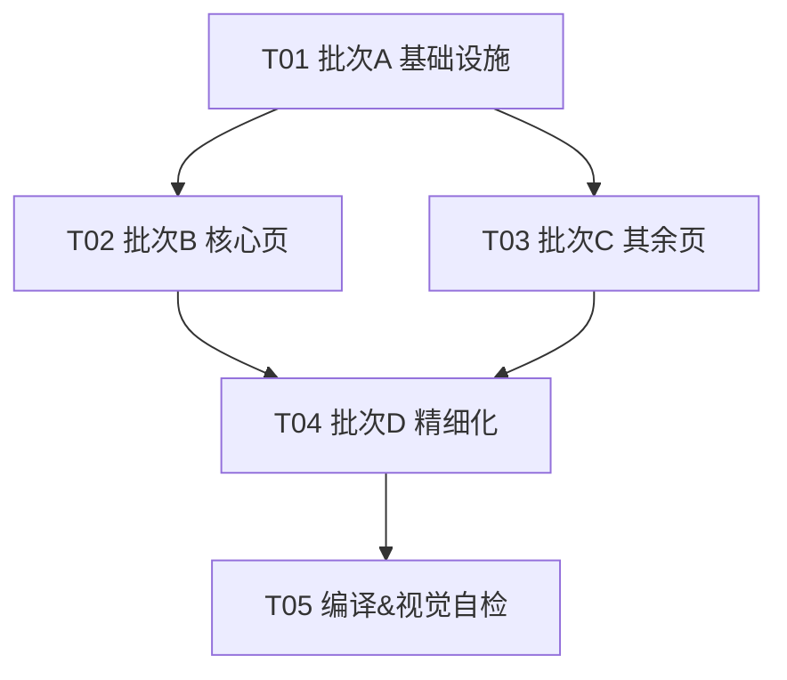

# ARCH｜安卓端 UI Design System 架构设计 + 全量页面接入任务分解

> 文档版本：v1.0
> 角色：高见远（Gao）· 架构师
> 团队：software-ui-opt
> 技术栈：Jetpack Compose + Material3（Kotlin 2.0.21 / Compose Compiler Plugin / Hilt 2.50）
> 项目路径：`/Users/luojianwei/Documents/Workbuddy/automation_project/android`
> 上游依据：PRD `docs/PRD_ui_design_system.md` v1.0 + 用户已确认决策 Q1–Q5

---

## 0. 用户已确认决策（落地为硬约束）

| # | 决策 | 落地方式 |
|---|---|---|
| Q1 | 深色模式主色保持 `0xFFFF8C00` | `darkScheme.primary = 0xFFFF8C00` |
| Q2 | secondary 浅 `0xFFB26A00` / 深 `0xFFFFB74D` | 采用 PRD §4.1.3 / §4.1.4 |
| Q3 | 底部导航深色：surface(0xFF1C1C1E) 底 + 选中渐变指示器橙色降透 | `MainScreen` 接入 `colorScheme` + 降透渐变 |
| Q4 | 状态 Tag 深色：深色 container + 浅色字 | 采用 PRD §4.4 StatusTag 深色方案 |
| Q5 | 顶栏去除渐变装饰，统一 `AppTopBar` | 返回箭头 `tint=primary`，标题 `onSurface` |

---

## 1. 实现方案 + 框架选型

### 1.1 技术难点

1. **散落颜色收敛**：21 个文件存在 `0xFFFF8C00 / 0xFFFF6B00 / 0xFFFF6A00 / 0xFFFF9800` 等硬编码橙色，以及 `private val Orange/NavOrange/AccentOrange` 重复声明，需统一到 `colorScheme.primary`。
2. **双模式主题切换**：需在不引入 Material You 的前提下，按 `isSystemInDarkTheme()` 切换 `lightScheme/darkScheme` 与 `AppStatusColors`。
3. **语义状态色治理**：现状「已领取蓝」「审核中蓝」取值漂移（0xFF2196F3 vs 0xFF42A5F5），需固定为 `AppStatusColors` 单一来源。
4. **顶栏范式统一**：并存 Material3 `TopAppBar` 与自定义 `Surface`/渐变头，需收敛为 `AppTopBar`。
5. **圆角 / 字号语义化**：散落 `14/16/20dp`、`13~18.sp` 硬编码，需收敛到 `Shape.radius*{Sm/Md/Lg/Xl}` 与 `MaterialTheme.typography` 语义层级。

### 1.2 框架选型

- **纯 Compose Material3 主题系统**，**不引入任何第三方依赖**，仅使用标准 `material3`（BOM 托管，需确认解析版本 ≥ 1.2.0，提供 `lightColorScheme/darkColorScheme`）。
- **主题注入点**：在 `MainActivity.kt` 将默认 `MaterialTheme { ... }` 替换为自封装 `AppTheme { ... }`。`AppTheme` 内部调用 `MaterialTheme(colorScheme, typography)` 并包一层 `CompositionLocalProvider(LocalStatusColors)` 暴露 `AppStatusColors`。
- **架构模式**：单向 Theme Ambient（Compose 官方推荐），页面通过 `MaterialTheme.colorScheme.*`、`MaterialTheme.typography.*`、`Shape.radius*`、`MaterialTheme.statusColors.*` 消费，无任何页面级颜色常量。

### 1.3 注入点映射

| PRD 概念 | 代码落地 |
|---|---|
| light/dark colorScheme | `Color.kt` 的 `lightScheme` / `darkScheme`（Material3 `lightColorScheme/darkColorScheme`） |
| shapes 尺度阶梯 | `Shape.kt` 的 `object Shape`（非 Material3 `Shapes`，直接引用 `Shape.radiusLg`） |
| typography 语义层级 | `Type.kt` 的 `AppTypography`（Material3 `Typography`） |
| 语义状态色 | `AppStatusColors.kt` 的 `AppStatusColors` + `LocalStatusColors` CompositionLocal |
| 主题包裹 | `AppTheme.kt` 的 `@Composable fun AppTheme(darkTheme, content)` |
| 入口替换 | `MainActivity.kt` 的 `setContent { AppTheme { ... } }` |

---

## 2. 目录结构与文件清单

### 2.1 新建 `ui/theme/`（基础设施）

| 文件 | 职责 |
|---|---|
| `ui/theme/Color.kt` | 品牌常量 `BrandOrange` + `lightScheme` / `darkScheme` 两套 `ColorScheme`（§4.1.3 / §4.1.4） |
| `ui/theme/Type.kt` | `AppTypography`：titleLarge/titleMedium/bodyLarge/bodyMedium/labelMedium/labelSmall（§4.3） |
| `ui/theme/Shape.kt` | `object Shape`：`radiusSm=8` / `radiusMd=12` / `radiusLg=16` / `radiusXl=24` dp（§4.2） |
| `ui/theme/AppStatusColors.kt` | `StatusColorSet` + `AppStatusColors` + `LightStatusColors` / `DarkStatusColors` + `LocalStatusColors` + `MaterialTheme.statusColors` 扩展（§4.1.2 / §4.4） |
| `ui/theme/AppTheme.kt` | `AppTheme(darkTheme, content)`，注入 colorScheme + typography + statusColors |

### 2.2 新建 `ui/components/`（公共组件）

| 文件 | 职责 |
|---|---|
| `ui/components/AppCard.kt` | 卡片：`shape=Shape.radiusLg`，`color=surface`，`shadowElevation=1.dp`，可选 `border` |
| `ui/components/AppTopBar.kt` | 顶栏：返回箭头 `tint=primary`，标题 `onSurface`，`titleLarge/titleMedium` |
| `ui/components/AppButton.kt` | 主按钮：`primary` 底 / `onPrimary` 字，`radiusSm`，`fillMaxWidth`，48dp |
| `ui/components/AppTextButton.kt` | 文字按钮：`primary` 字，无背景，`radiusSm`，40dp |
| `ui/components/StatusTag.kt` | 状态标签：语义色浅底 + 深字（深色 container+浅字），`radiusSm` |
| `ui/components/EmptyState.kt` | 空状态：图标 `outline` 64dp，文案 `onSurfaceVariant bodyLarge` 居中 |
| `ui/components/LoadingIndicator.kt` | 加载：`CircularProgressIndicator`，`color=primary`，4dp，居中 |
| `ui/components/SegmentedTab.kt` | 复用：分段切换（P1-1） |
| `ui/components/FilterChipGroup.kt` | 复用：筛选 Chip 组（P1-1） |

### 2.3 修改入口

| 文件 | 改动 |
|---|---|
| `app/src/main/java/com/task/platform/MainActivity.kt` | `MaterialTheme {` → `AppTheme {`，移除默认主题，import `AppTheme` |

### 2.4 需接入的页面文件清单（按模块分组）

> 实际仓库共有 **24 个主题承载面**（21 Screen + `AutomationProgressSheet` + `BaseScreen` + `ThumbnailImage`）。PRD 所述「28 页」包含子 composable / sheet，`下方清单为工程落地权威文件集`，按 8 模块归组（在 PRD 原分组上**补充了 `ad` 模块**，因其 `AdHallScreen.kt:30` 含硬编码 `0xFFFF6B00` 必须收敛）。

**publish 模块**（`ui/publish/`）
- `PublishScreen.kt` — 私色 `Orange`，`0xFFFF8C00`×2（:83,:99），自定义头
- `VideoEditorScreen.kt` — `0xFFFF6A00`（:74-77），多处圆角/字号
- `PreviewEngine.kt`（支撑，无主题问题，随模块一并抽查）
- `VideoThumbExtractor.kt`（支撑，同）

**task 模块**（`ui/task/`）
- `TaskHallScreen.kt` — `0xFFFF8C00`（:35）+ `0xFFFF9800`（:498），`TopAppBar`
- `TaskDetailScreen.kt` — `0xFFFF8C00`（:45），卡片/状态
- `MyTasksScreen.kt` — `0xFFFF8C00`（:35）+ `0xFFFF9800`（:398）
- `ScreenshotUploadScreen.kt` — `0xFFFF8C00`（:77）
- `AutomationProgressSheet.kt` — `0xFFFF8C00`（:19），底表容器

**main 模块**（`ui/main/`）
- `MainScreen.kt` — `private val NavOrange/NavOrangeBg/NavGrayUnselected/NavBarBg`，`0xFFFF8C00`（:54），底部导航深色化（P1-4）

**earnings 模块**（`ui/earnings/`）
- `EarningsScreen.kt` — `0xFFFF8C00`（:44）
- `TransactionRecordsScreen.kt` — `TopAppBar` / 字号
- `WithdrawScreen.kt` — `0xFFFF8C00`（:91）

**profile 模块**（`ui/profile/`）
- `ProfileScreen.kt` — `0xFFFF8C00`（:66）+ `0xFFFF9800`（:77），`TopAppBar`
- `SettingsScreen.kt` — `0xFFFF8C00`×3（:84,:100,:166）
- `EditProfileScreen.kt` — `0xFFFF8C00`（:130）
- `RealAuthScreen.kt` — `0xFFFF8C00`（:35）+ `0xFFFF9800`（:47）
- `WalletBindingScreen.kt` — `0xFFFF8C00`（:91），`TopAppBar`
- `AboutScreen.kt` — `0xFFFF8C00`×4（:56,:124,:132,:140）
- `AgreementScreen.kt` — `0xFFFF8C00`×2（:85,:102）

**auth 模块**（`ui/login/`）
- `LoginScreen.kt` — `0xFFFF8C00`（:41）
- `RegisterScreen.kt` — `0xFFFF8C00`（:35），`TopAppBar`
- `SplashScreen.kt` — 快手橙 `0xFFFF6B00`（:53）→ 收敛为 `primary`（品牌权威，见 §8）

**ad 模块**（`ui/ad/`）— PRD 未单列，实际存在
- `AdHallScreen.kt` — `private val Orange`，`0xFFFF6B00`（:30）→ `primary`

**components / base 模块**
- `ui/components/ThumbnailImage.kt` — 含 `CircularProgressIndicator` 与 `fontSize` 硬编码 → 接入 `LoadingIndicator` + typography
- `base/BaseScreen.kt` — 裸 `CircularProgressIndicator()` → `LoadingIndicator`

---

## 3. 数据结构与接口（类图式 + Kotlin 签名）

> 完整 Mermaid 类图见 `docs/class-diagram.mermaid`。

### 3.1 主题与 Token（Color.kt / Type.kt / Shape.kt / AppStatusColors.kt）

```kotlin
// Color.kt
val BrandOrange: Color = Color(0xFFFF8C00)                       // 权威主色（浅/深一致）
val lightScheme: ColorScheme = lightColorScheme(primary = 0xFFFF8C00, onPrimary = 0xFFFFFFFF, /* §4.1.3 全量 */)
val darkScheme:  ColorScheme = darkColorScheme( primary = 0xFFFF8C00, onPrimary = 0xFFFFFFFF, /* §4.1.4 全量 */)

// Type.kt
val AppTypography: Typography = Typography(
    titleLarge  = TextStyle(20.sp, FontWeight.Bold,     lineHeight = 26.sp),
    titleMedium = TextStyle(18.sp, FontWeight.SemiBold, lineHeight = 24.sp),
    bodyLarge   = TextStyle(16.sp, FontWeight.Medium,   lineHeight = 22.sp),
    bodyMedium  = TextStyle(14.sp, FontWeight.Normal,   lineHeight = 20.sp),
    labelMedium = TextStyle(12.sp, FontWeight.Medium,   lineHeight = 16.sp),
    labelSmall  = TextStyle(11.sp, FontWeight.Normal,   lineHeight = 14.sp),
)

// Shape.kt
object Shape {
    val radiusSm = RoundedCornerShape(8.dp)
    val radiusMd = RoundedCornerShape(12.dp)
    val radiusLg = RoundedCornerShape(16.dp)
    val radiusXl = RoundedCornerShape(24.dp)
}

// AppStatusColors.kt
data class StatusColorSet(val main: Color, val container: Color, val content: Color)
data class AppStatusColors(
    val reviewing: StatusColorSet,  // 审核中 蓝 0xFF42A5F5
    val approved:  StatusColorSet,  // 已通过 绿 0xFF4CAF50
    val rejected:  StatusColorSet,  // 已拒绝 红 0xFFE53935
    val pending:   StatusColorSet,  // 待领取 橙 0xFFFF8C00
    val timeout:   StatusColorSet,  // 超时 灰 0xFF9E9E9E
)
val LightStatusColors: AppStatusColors = AppStatusColors(/* §4.1.2 浅底/深字 */)
val DarkStatusColors:  AppStatusColors = AppStatusColors(/* §4.4 深色 container+浅字 */)
val LocalStatusColors = staticCompositionLocalOf { LightStatusColors }
val MaterialTheme.statusColors: AppStatusColors
    @Composable @ReadOnlyComposable get() = LocalStatusColors.current
```

### 3.2 主题入口（AppTheme.kt）

```kotlin
@Composable
fun AppTheme(
    darkTheme: Boolean = isSystemInDarkTheme(),
    content: @Composable () -> Unit
) {
    val colorScheme = if (darkTheme) darkScheme else lightScheme
    val statusColors = if (darkTheme) DarkStatusColors else LightStatusColors
    MaterialTheme(colorScheme = colorScheme, typography = AppTypography) {
        CompositionLocalProvider(LocalStatusColors provides statusColors, content = content)
    }
}
```

### 3.3 公共组件签名

```kotlin
// AppCard.kt
@Composable fun AppCard(
    modifier: Modifier = Modifier,
    onClick: (() -> Unit)? = null,
    border: Boolean = false,
    contentPadding: Dp = 16.dp,
    content: @Composable ColumnScope.() -> Unit
)

// AppTopBar.kt
@Composable fun AppTopBar(
    title: String,
    onBackClick: (() -> Unit)? = null,
    actions: @Composable RowScope.() -> Unit = {}
)

// AppButton.kt
@Composable fun AppButton(
    text: String,
    onClick: () -> Unit,
    modifier: Modifier = Modifier.fillMaxWidth(),
    enabled: Boolean = true
)

// AppTextButton.kt
@Composable fun AppTextButton(
    text: String,
    onClick: () -> Unit,
    modifier: Modifier = Modifier,
    enabled: Boolean = true
)

// StatusTag.kt
enum class StatusType { Reviewing, Approved, Rejected, Pending, Timeout }
@Composable fun StatusTag(type: StatusType)

// EmptyState.kt
@Composable fun EmptyState(
    message: String,
    modifier: Modifier = Modifier,
    icon: ImageVector = Icons.Default.Inbox
)

// LoadingIndicator.kt
@Composable fun LoadingIndicator(modifier: Modifier = Modifier)

// SegmentedTab.kt
@Composable fun SegmentedTab(
    items: List<String>,
    selectedIndex: Int,
    onSelect: (Int) -> Unit,
    modifier: Modifier = Modifier
)

// FilterChipGroup.kt
@Composable fun FilterChipGroup(
    options: List<String>,
    selected: Set<String>,
    onToggle: (String) -> Unit,
    modifier: Modifier = Modifier
)
```

### 3.4 关键关系（Mermaid classDiagram 摘要）

- `AppTheme` ──uses──> `ColorTokens(lightScheme/darkScheme)`、`AppTypography`、`AppStatusColors`
- `AppCard` / `AppButton` / `AppTextButton` ──uses──> `Shape.radius*`
- `AppTopBar` / `AppButton` / `LoadingIndicator` / `EmptyState` ──reads──> `MaterialTheme.colorScheme.*`
- `StatusTag` ──reads──> `MaterialTheme.statusColors.<type>.container/content`

---

## 4. 程序调用 / 接入流程

> 完整 Mermaid 时序图见 `docs/sequence-diagram.mermaid`。

**主线（主题注入）**
1. `MainActivity.onCreate()` → `setContent { AppTheme { ... } }`（替换默认 `MaterialTheme`）。
2. `AppTheme` 依据 `isSystemInDarkTheme()` 选择 `lightScheme/darkScheme`，并通过 `CompositionLocalProvider` 注入 `AppStatusColors`。
3. 内部 `MaterialTheme(colorScheme, typography)` 建立 Compose Ambient。

**页面接入（以 PublishScreen 为例）**
1. 页面删除 `private val Orange = Color(0xFFFF8C00)`。
2. 原 `TopAppBar` / 自定义 `Surface` 头 → `AppTopBar(title, onBackClick)`。
3. 原 `Surface(shape=RoundedCornerShape(16.dp), color=Color.White)` → `AppCard { ... }`。
4. 原 `Button(colors=ButtonDefaults...)` → `AppButton(text, onClick)`；次级操作 → `AppTextButton`。
5. 所有 `Color(0xFFFF8C00)` / `0xFFFF6B00` → `MaterialTheme.colorScheme.primary`。
6. 状态展示 → `StatusTag(StatusType.Pending)`（读 `statusColors`）。
7. 所有 `fontSize = X.sp` → `MaterialTheme.typography.bodyLarge/bodyMedium/...`。
8. 所有 `RoundedCornerShape(14/16/20.dp)` → `Shape.radius*{Sm/Md/Lg/Xl}`。
9. 裸 `CircularProgressIndicator()` → `LoadingIndicator()`。

---

## 5. 全量页面接入任务列表（有序、含依赖、按实现顺序）

> 以下为**高层 5 任务（T01–T05）**映射 PRD 的 4 批次；**每任务均 ≥3 文件、T01 为基础设施、依赖链最短**。详细「逐文件改动点」见 §5.5 附录。

### T01 · 批次 A：主题基础设施（P0-1/2/3/4/5 基座）
- **目标**：落地 `ui/theme/*` 与 `ui/components/*`，`MainActivity` 接入 `AppTheme`，全站具备统一主题 Ambient。
- **源文件**：`ui/theme/Color.kt`、`ui/theme/Type.kt`、`ui/theme/Shape.kt`、`ui/theme/AppStatusColors.kt`、`ui/theme/AppTheme.kt`、`ui/components/AppCard.kt`、`ui/components/AppTopBar.kt`、`ui/components/AppButton.kt`、`ui/components/AppTextButton.kt`、`ui/components/StatusTag.kt`、`ui/components/EmptyState.kt`、`ui/components/LoadingIndicator.kt`、`MainActivity.kt`
- **依赖**：无（首任务）
- **优先级**：P0

### T02 · 批次 B：核心页面接入（publish / task / main）
- **目标**：收敛高频核心页硬编码橙、顶栏、卡片、状态色；`MainScreen` 底部导航深色化。
- **源文件**：`publish/PublishScreen.kt`、`publish/VideoEditorScreen.kt`、`task/TaskHallScreen.kt`、`task/TaskDetailScreen.kt`、`task/MyTasksScreen.kt`、`task/ScreenshotUploadScreen.kt`、`task/AutomationProgressSheet.kt`、`main/MainScreen.kt`
- **依赖**：T01
- **优先级**：P0

### T03 · 批次 C：其余页面接入（earnings / profile / auth / ad / components / base）
- **目标**：剩余全部页面接入主题，消除 `private val` 颜色与硬编码橙、统一顶栏与加载态。
- **源文件**：`earnings/EarningsScreen.kt`、`earnings/TransactionRecordsScreen.kt`、`earnings/WithdrawScreen.kt`、`profile/*`（7 文件）、`login/LoginScreen.kt`、`login/RegisterScreen.kt`、`login/SplashScreen.kt`、`ad/AdHallScreen.kt`、`ui/components/ThumbnailImage.kt`、`base/BaseScreen.kt`
- **依赖**：T01
- **优先级**：P0–P1

### T04 · 批次 D：精细化收尾（P1/P2）
- **目标**：`SegmentedTab`/`FilterChipGroup`/`AppTextButton` 复用、字号语义化全面替换、空状态插画占位、微交互（按压态 / Tab `tween(300)`）。
- **源文件**：`ui/components/SegmentedTab.kt`、`ui/components/FilterChipGroup.kt`、`ui/components/AppTextButton.kt`、`ui/components/EmptyState.kt`、`publish/VideoEditorScreen.kt`、`task/TaskDetailScreen.kt`（及全量页面字号复查）
- **依赖**：T02、T03
- **优先级**：P1–P2

### T05 · 全量编译 & 视觉一致性自检
- **目标**：`./gradlew assembleDebug` 通过；按共享约定（§7）抽查无 `private val` 颜色、无 `fontSize=X.sp`、无裸 `Color(0x...)`。
- **源文件**：全仓库（无新增，审查型任务）
- **依赖**：T04
- **优先级**：P0（验收门禁）

### 5.1 任务依赖图（Mermaid）



### 5.2 实现顺序小结

`T01（并行基底）` → `T02 / T03（可并行接入）` → `T04（收尾）` → `T05（验收）`。

### 5.3 各批次优先级映射（对照 PRD）

| 批次 | 覆盖 PRD 条目 | 优先级 |
|---|---|---|
| A | P0-1/2/3/4/5 | P0 |
| B | P0-2/3/4/5 + P1-4 | P0 |
| C | P0-2/3/4/5 | P0–P1 |
| D | P1-1/2/3 + P2-1/2/3/4 | P1–P2 |

### 5.4 关键文件改动点（代表示例）

- **MainActivity.kt**：`MaterialTheme {` → `AppTheme {`；删除 `import androidx.compose.material3.MaterialTheme` 改用 `AppTheme`。
- **PublishScreen.kt**：删 `private val Orange`；`Color(0xFFFF8C00)`×2 → `colorScheme.primary`；自定义头 → `AppTopBar`；卡片 → `AppCard`；状态用 `StatusTag`。
- **MainScreen.kt**：删 `NavOrange/NavOrangeBg/NavGrayUnselected/NavBarBg`；选中渐变改 `primary` 降透；底栏 `radiusXl`；深色 `NavBarBg = surface(0xFF1C1C1E)`。
- **BaseScreen.kt**：裸 `CircularProgressIndicator()` → `LoadingIndicator()`。
- **ThumbnailImage.kt**：`fontSize` 硬编码 → typography；`CircularProgressIndicator` → `LoadingIndicator()`。
- **SplashScreen.kt / AdHallScreen.kt**：`0xFFFF6B00` → `colorScheme.primary`（品牌权威）。

### 5.5 附录：逐文件改动点全表

| 模块 | 文件 | 具体改动点 |
|---|---|---|
| theme | Color.kt | 新建 `BrandOrange` + `lightScheme/darkScheme` |
| theme | Type.kt | 新建 `AppTypography`（6 语义层级） |
| theme | Shape.kt | 新建 `object Shape`（radiusSm/Md/Lg/Xl） |
| theme | AppStatusColors.kt | 新建 `AppStatusColors` + `LocalStatusColors` + 扩展 |
| theme | AppTheme.kt | 新建 `AppTheme(darkTheme, content)` |
| components | AppCard/AppTopBar/AppButton/AppTextButton/StatusTag/EmptyState/LoadingIndicator.kt | 全量新建（见 §3.3） |
| entry | MainActivity.kt | `MaterialTheme{`→`AppTheme{` |
| publish | PublishScreen.kt | 删 `Orange`；`0xFFFF8C00`×2→`primary`；头→`AppTopBar`；卡片→`AppCard`；状态→`StatusTag` |
| publish | VideoEditorScreen.kt | `0xFFFF6A00`→`primary`；圆角→`Shape.*`；字号→typography |
| task | TaskHallScreen.kt | `0xFFFF8C00`/`0xFFFF9800`→`primary`；`TopAppBar`→`AppTopBar` |
| task | TaskDetailScreen.kt | `0xFFFF8C00`→`primary`；卡片→`AppCard`；状态→`StatusTag` |
| task | MyTasksScreen.kt | `0xFFFF8C00`/`0xFFFF9800`→`primary`；状态蓝统一 `statusColors.reviewing` |
| task | ScreenshotUploadScreen.kt | `0xFFFF8C00`→`primary` |
| task | AutomationProgressSheet.kt | `0xFFFF8C00`→`primary`；底表容器→`surface`+`Shape` |
| main | MainScreen.kt | 删 `NavOrange*`；底栏深色调；`radiusXl`；选中渐变降透 |
| earnings | EarningsScreen.kt | `0xFFFF8C00`→`primary` |
| earnings | TransactionRecordsScreen.kt | `TopAppBar`→`AppTopBar`；字号→typography |
| earnings | WithdrawScreen.kt | `0xFFFF8C00`→`primary` |
| profile | ProfileScreen.kt | `0xFFFF8C00`/`0xFFFF9800`→`primary`；头→`AppTopBar` |
| profile | SettingsScreen.kt | `0xFFFF8C00`×3→`primary` |
| profile | EditProfileScreen.kt | `0xFFFF8C00`→`primary` |
| profile | RealAuthScreen.kt | `0xFFFF8C00`/`0xFFFF9800`→`primary` |
| profile | WalletBindingScreen.kt | `0xFFFF8C00`→`primary`；头→`AppTopBar` |
| profile | AboutScreen.kt | `0xFFFF8C00`×4→`primary` |
| profile | AgreementScreen.kt | `0xFFFF8C00`×2→`primary` |
| auth | LoginScreen.kt | `0xFFFF8C00`→`primary` |
| auth | RegisterScreen.kt | `0xFFFF8C00`→`primary`；头→`AppTopBar` |
| auth | SplashScreen.kt | 快手橙 `0xFFFF6B00`→`primary` |
| ad | AdHallScreen.kt | 删 `private val Orange`；`0xFFFF6B00`→`primary` |
| components | ThumbnailImage.kt | `fontSize`→typography；`CircularProgressIndicator`→`LoadingIndicator` |
| base | BaseScreen.kt | 裸 `CircularProgressIndicator()`→`LoadingIndicator()` |

---

## 6. 依赖包

**无新增第三方依赖。** 全部基于现有标准库：

```
- androidx.compose.material3:material3            # 主题/组件（BOM 托管，⚠ 需确认解析版本 ≥ 1.2.0）
- androidx.compose.material:material-icons-extended # 图标（IReps.Default.Inbox 等）
- androidx.compose.ui:ui                           # Shape/Color/TextStyle
- org.jetbrains.kotlinx:kotlinx-coroutines         # LaunchedEffect 等
```

> 现有 `build.gradle.kts` 中 `material3` 未显式钉版本（由 Compose BOM 解析）。工程师接入前确认 BOM 实际解析 `material3 ≥ 1.2.0`（`lightColorScheme/darkColorScheme` 自 1.1.0 起可用，`staticCompositionLocalOf` 一直可用）。

---

## 7. 共享知识（跨文件约定 · 强制）

1. **禁止页面级颜色常量**：任何页面不得再声明 `private val Orange/NavOrange/... = Color(0x...)`；一律引用 `MaterialTheme.colorScheme.*` 或 `MaterialTheme.statusColors.*`。
2. **字号只用语义层级**：禁止 `fontSize = 13.sp` 等硬编码；一律 `MaterialTheme.typography.titleLarge/titleMedium/bodyLarge/bodyMedium/labelMedium/labelSmall`。
3. **圆角只用 `Shape` 对象**：禁止 `RoundedCornerShape(14.dp)` 等字面量；一律 `Shape.radiusSm/Md/Lg/Xl`。
4. **状态色只用语义字段**：`StatusTag(StatusType.*)` 内部读 `MaterialTheme.statusColors`，禁止页面直接写 `0xFF42A5F5` 等状态色。
5. **顶栏一律 `AppTopBar`**：禁止自定义 `Surface`/渐变头与裸 `TopAppBar`；返回箭头自动 `tint=primary`、标题 `onSurface`。
6. **加载态一律 `LoadingIndicator`**：禁止裸 `CircularProgressIndicator()`。
7. **主色权威**：品牌橙统一 `colorScheme.primary = 0xFFFF8C00`（浅/深一致），含历史 `0xFFFF6B00 / 0xFFFF6A00 / 0xFFFF9800` 全部收敛。

---

## 8. 待明确事项

- **基本明确**，仅余以下 2 点需 PM/设计确认（不影响 T01 启动）：
  1. **`SplashScreen` / `AdHallScreen` 的 `0xFFFF6B00`（快手橙/旧橙）**：按 P0-2 品牌权威原则，默认收敛为 `colorScheme.primary = 0xFFFF8C00`。若设计希望 Splash 保留「快手橙」差异化，请明确；否则按主色处理。（本架构默认收敛。）
  2. **`ad` 模块分组**：PRD §3/任务分组未单列 `ad`，但 `AdHallScreen.kt` 含硬编码橙色必须接入。本架构将其归入独立 `ad` 模块（见 §2.4）。如 PM 认为应并入 `publish` 或 `base`，可在 T03 调整分组。
- 其余 PRD Q1–Q5 已由用户决策全部拍板，无歧义。

---

## 附录 A：类图（class-diagram.mermaid）

见 `docs/class-diagram.mermaid`。

## 附录 B：时序图（sequence-diagram.mermaid）

见 `docs/sequence-diagram.mermaid`。
