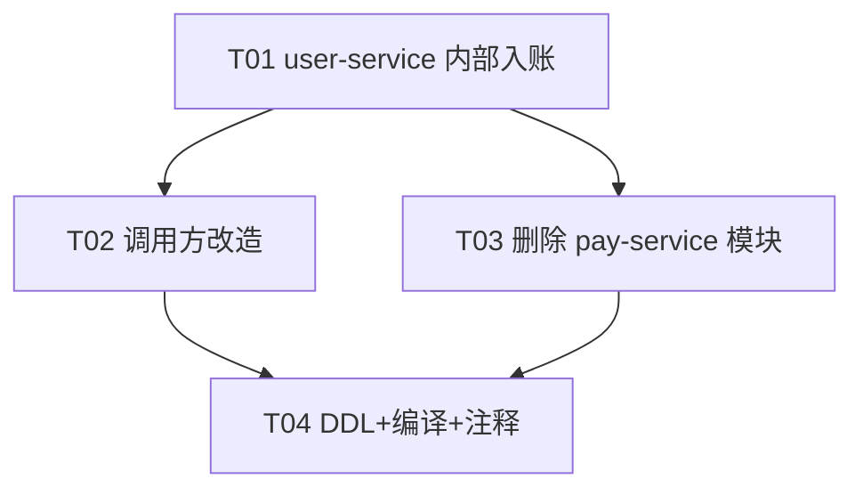

# 增量设计文档（最终版）：任务审核入账改为经 task-user-service 内部接口

> 目标：删除 `task-pay-service` 的「任务审核自动发奖」机制（`t_reward_grant` 表、GrantController/GrantService/RewardGrant/Mapper、补偿 Job、`RewardGrantService` 客户端），
> 将「审核通过 → 奖励入账」统一改为「审核通过 → 调 `task-user-service` 内部接口 `POST /internal/earnings/credit` 直接给用户虚拟余额（`t_user_earnings`）入账」。
> 提现流程本次不做（留 TODO）。

---

## 0. R1 决议（已确认）

两条审核路径**都保留，不改商户扣费逻辑**，仅把各自的发奖调用统一替换为新内部接口：

| 路径 | 位置 | 原发奖调用 | 本次处理 |
|---|---|---|---|
| admin 审核 | `AdminTaskRecordController.approve()` | `rewardGrantService.grant()` → pay-service | 替换为 `EarningsCreditClient.credit()` → user-service |
| task 审核（兼容端点） | `TaskService.reviewTaskRecord()` | `grantUserReward()` → pay-service | 替换为内联调 user-service；删除 `grantUserReward()` 私有方法 |

> 双路径并存 + 商户扣费仅 admin 触发，是**既有问题**，不在本次范围，仅作为「已知后续项」（见 §5）。

---

## 1. 新内部入账接口契约

### 1.1 端点

```
POST /internal/earnings/credit
Host: task-user-service (端口 8081)
```

- **不经过网关**：gateway 仅代理 `/api/user/**`，`/internal/**` 无路由，外部不可达；调用方**内部直连** `user.api.base-url`（默认 `http://localhost:8081`）。
- **鉴权**：`X-Internal-Token: <internal.api-token>`，由新建 `InternalApiFilter` 校验（仅作用于 `/internal/**`）。

### 1.2 请求

```
Headers:
  Content-Type: application/json
  X-Internal-Token: task-internal-2026        # InternalApiConstants.HEADER_NAME

Body (application/json):
{
  "userId": 123,            // Long   必填 用户ID
  "taskRecordId": 456,      // Long   必填 用户任务记录ID（幂等键）
  "taskId": 789,            // Long   可空 任务ID
  "amount": 10.00,          // BigDecimal 必填 奖励金额（正数）
  "type": 1                 // Integer 选填 默认 1=任务收益（见 UserEarnings.type）
}
```

### 1.3 响应

统一返回 `ApiResponse`（与现有 `ApiResponse.success/error` 一致）。

```jsonc
// 正常入账（HTTP 200）
{ "code": 200, "data": { "bizId": "456", "balanceAfter": 110.00, "idempotent": false }, "msg": "入账成功" }

// 幂等命中：同一 taskRecordId 已入账（HTTP 200，不重复入账）
{ "code": 200, "data": { "bizId": "456", "balanceAfter": 110.00, "idempotent": true },  "msg": "已入账（幂等命中）" }

// 鉴权失败（HTTP 401）
{ "code": 401, "msg": "Unauthorized internal call" }

// 参数/业务异常（HTTP 200 + code≠200 或 5xx，沿用 ApiResponse / BusinessException）
```

> `data` 结构为建议形态，工程师可在 `EarningsService`/`InternalEarningsController` 内定义VO，字段名可微调，但**必须**返回 `bizId`（幂等键）与 `idempotent` 标识。

### 1.4 行为（`EarningsService.credit()`）

1. 计算 `bizId = String.valueOf(taskRecordId)`（幂等键）。
2. 按 `bizId` 查 `t_user_earnings`（`selectByBizId`）：若存在 → 直接返回已有记录，`idempotent=true`，**不重复入账**。
3. 计算 `prev = selectLatestBalance(userId)`（`NULL → 0`）。
4. `balanceAfter = prev + amount`。
5. 插入一条流水（`status=1`，字段映射见 §6）。
6. 捕获 `DuplicateKeyException`（并发竞态）→ 重新 `selectByBizId` 返回，`idempotent=true`。

### 1.5 幂等保证

- **主键**：`t_user_earnings.biz_id` 加 `UNIQUE KEY uk_biz_id (biz_id)`（见 §2）。
- **前置判断**：插入前先 `selectByBizId` 查重。
- **DB 兜底**：唯一索引冲突即 `DuplicateKeyException`，视为已入账。
- 同一 `taskRecordId` 重复调用 → 仅入账一次。

---

## 2. 数据层 DDL

### 2.1 `t_user_earnings`（以 task-user-service 的 `UserEarnings` 实体为准）

字段已与 pay-service 版本一致，均含 `user_id / related_id / type / amount / balance_after / status / remark / biz_id / created_at`。
**`biz_id` 列已存在**（实体 `@TableField("biz_id")`），无需新增列，仅补唯一索引：

```sql
-- 预检：确认无 NULL / 重复 biz_id 后再加索引
-- SELECT COUNT(*) FROM t_user_earnings WHERE biz_id IS NULL;
-- SELECT biz_id, COUNT(*) c FROM t_user_earnings GROUP BY biz_id HAVING c > 1;
-- （现有数据 biz_id 为发放单号 RG...，与新值「纯数字 taskRecordId」不冲突；预检为空再执行）

ALTER TABLE t_user_earnings ADD UNIQUE KEY uk_biz_id (biz_id);
```

> 说明：`biz_id` 为 `VARCHAR`，存放 `String.valueOf(taskRecordId)` 作为任务奖励幂等键；未来提现（type=5）等其它流水用各自唯一单号写 `biz_id`，互不冲突。

### 2.2 删除 `t_reward_grant`

```sql
-- 建议先备份
-- CREATE TABLE t_reward_grant_bak LIKE t_reward_grant;
-- INSERT INTO t_reward_grant_bak SELECT * FROM t_reward_grant;

DROP TABLE IF EXISTS t_reward_grant;
```

---

## 3. 逐文件改动清单（绝对路径，按模块分组）

### 3.1 task-user-service（新增 / 修改）

| 操作 | 绝对路径 | 说明 |
|---|---|---|
| **新增** | `task-user-service/src/main/java/com/task/platform/user/controller/InternalEarningsController.java` | `POST /internal/earnings/credit`，收 `CreditRequest{userId,taskRecordId,taskId,amount,type}`，转 `EarningsService.credit()` |
| **新增** | `task-user-service/src/main/java/com/task/platform/user/security/InternalApiFilter.java` | 仿 pay-service：仅对 `/internal/**` 校验 `X-Internal-Token`，其余放行（`@Component` 会被 `UserApplication` 扫描到） |
| **修改** | `task-user-service/src/main/java/com/task/platform/user/service/EarningsService.java` | 新增 `credit(Long userId, Long taskRecordId, Long taskId, BigDecimal amount, Integer type)`（逻辑见 §1.4），保留 `getSummary/getRecords` |
| **修改** | `task-user-service/src/main/java/com/task/platform/user/mapper/UserEarningsMapper.java` | 新增 `selectByBizId(String bizId)`（或 `existsByIdempotencyKey`）；`selectLatestBalance` 已存在复用 |
| **确认** | `task-user-service/src/main/java/com/task/platform/user/entity/UserEarnings.java` | 字段已满足；`type` 注释补 `5=提现` 可选（与 `getTypeLabel` 对齐） |
| **修改** | `task-user-service/src/main/resources/application.yml` | 新增 `internal:\n  api-token: task-internal-2026` |

### 3.2 task-admin-api（修改 / 删除）

| 操作 | 绝对路径 | 说明 |
|---|---|---|
| **删除** | `task-admin-api/src/main/java/com/task/platform/admin/service/RewardGrantService.java` | 旧的 pay-service 发奖客户端 |
| **新增** | `task-admin-api/src/main/java/com/task/platform/admin/service/EarningsCreditClient.java` | 内部 HTTP 客户端：`POST {user.api.base-url}/internal/earnings/credit`，带 `X-Internal-Token`，请求体含 `type=1` |
| **修改** | `task-admin-api/src/main/java/com/task/platform/admin/controller/AdminTaskRecordController.java` | `approve()`：移除 `RewardGrantService` 字段与 `rewardGrantService.grant(...)`，改为 `earningsCreditClient.credit(userId, recordId, taskId, rewardAmount, 1)`；商户扣费、幂等守卫、`markGranted()` 保留 |
| **删除** | `task-admin-api/src/main/java/com/task/platform/admin/schedule/RewardGrantCompensationJob.java` | 补偿任务不再需要 |
| **修改** | `task-admin-api/src/main/java/com/task/platform/admin/mapper/UserTaskRecordMapper.java` | 删除 `selectPendingGrants()`；保留 `approve()` / `markGranted()` |
| **修改** | `task-admin-api/src/main/resources/application.yml` | 删除 `pay:\n  api-base-url: ...`；新增 `user:\n  api-base-url: http://localhost:8081`；保留 `internal.api-token` |

### 3.3 task-task-service（修改 / 删除）

| 操作 | 绝对路径 | 说明 |
|---|---|---|
| **修改** | `task-task-service/src/main/java/com/task/platform/task/service/TaskService.java` | `reviewTaskRecord()` 内：将 `grantUserReward(...)` 调用替换为内联 HTTP `POST {user.api.base-url}/internal/earnings/credit`（复用现有 `REST_TEMPLATE` + `internalApiToken`，body 含 `type=1`）；**删除私有方法 `grantUserReward()`（原第 522–559 行）**；`reviewTaskRecord` 其余逻辑（置 status=2、rewardGrantedAt、累加 used_quota/used_points）保留 |
| **修改** | `task-task-service/src/main/resources/application.yml` | 删除 `pay:\n  api-base-url: ...`；新增 `user:\n  api-base-url: http://localhost:8081`；保留 `internal.api-token` |

> 校验：`pay.api.base-url` 在 task-service 中仅被 `grantUserReward()` 使用，删除该方法后该配置项可整体移除。

### 3.4 删除 pay-service 模块 + 根 pom + 网关路由

| 操作 | 绝对路径 | 说明 |
|---|---|---|
| **删除** | `task-pay-service/`（整个目录） | GrantController / GrantService / RewardGrant / RewardGrantMapper / pay 版 UserEarnings / pay 版 UserEarningsMapper / InternalApiFilter / PayServiceApplication / resources / tests |
| **修改** | `pom.xml`（根） | `<modules>` 中删除 `<module>task-pay-service</module>` |
| **修改** | `task-gateway/src/main/resources/application.yml` | 删除 `id: task-pay-service` 整段路由（`Path=/api/pay/**` → `8087`） |

### 3.5 数据迁移脚本（DDL 落库）

| 操作 | 绝对路径 | 说明 |
|---|---|---|
| **新增** | `db/migration/V2026_01_10__add_uk_biz_id.sql` | `ALTER TABLE t_user_earnings ADD UNIQUE KEY uk_biz_id (biz_id);` |
| **新增** | `db/migration/V2026_01_10__drop_t_reward_grant.sql` | `DROP TABLE IF EXISTS t_reward_grant;` |

### 3.6 共享常量（保留 + 注释更新）

| 操作 | 绝对路径 | 说明 |
|---|---|---|
| **修改** | `task-common/src/main/java/com/task/platform/common/constant/InternalApiConstants.java` | 保留 `HEADER_NAME` / `DEFAULT_TOKEN`；javadoc 改为「admin/task → user-service 内部调用」，去掉对 pay-service 的描述 |

---

## 4. 有序任务列表（T01~T04）

> 原则：**先建新路（T01）→ 改调用方（T02）→ 拆旧模块（T03）→ 收尾 DDL/编译（T04）**。
> T02 与 T03 对 pay-service 仅为运行时 HTTP 字符串引用，无编译依赖；但上线顺序应先 T02 后 T03，避免 T03 停服后调用方仍指向已删服务。

| 任务 | 名称 | 涉及文件（见 §3 编号） | 依赖 | 优先级 |
|---|---|---|---|---|
| **T01** | task-user-service：新增内部入账接口 + 过滤器 + 本地自测 | 3.1 全部（1–6） | 无 | P0 |
| **T02** | 调用方改造：admin-api + task-task-service 改走 user-service | 3.2（7–12）+ 3.3（13–14） | T01 | P0 |
| **T03** | 删除 pay-service 模块 + 网关/根 pom 清理 | 3.4（15–17） | T01（建议 T02 后上线） | P0 |
| **T04** | 收尾：DDL 落库 + 全量编译校验 + 常量注释 | 3.5（18–19）+ 3.6（20） | T02, T03 | P1 |

### 4.1 依赖图



### 4.2 执行顺序与自测要点

1. **T01**：实现 `InternalEarningsController` / `InternalApiFilter` / `EarningsService.credit()` / `UserEarningsMapper.selectByBizId`。
   - **自测前置**：本地先执行 §2.1 的 `ALTER ... ADD UNIQUE KEY uk_biz_id`（或等 T04 统一执行，但自测前必须存在索引才能验证幂等）。
   - **自测**：`curl -X POST localhost:8081/internal/earnings/credit -H 'X-Internal-Token: task-internal-2026' -d '{"userId":1,"taskRecordId":100,"amount":5.00,"type":1}'`
     - 首次 → 余额 +5，`idempotent=false`；重复同 `taskRecordId` → `idempotent=true`、余额不变。
     - 不带/错 token → 401。
2. **T02**：改造两调用方，`approve()` / `reviewTaskRecord()` 均改调 user-service；删除 `RewardGrantService` / `RewardGrantCompensationJob` / `grantUserReward()`。联调审核通过 → `user_earnings` 新增 type=1 流水、余额增加。
3. **T03**：确认无调用方再引用 pay-service 后，停 pay-service、删模块目录、去根 pom `<module>`、去网关 `/api/pay/**` 路由。
4. **T04**：执行 §2 两段 DDL（建索引 + DROP 表，先备份），全量 `mvn compile` / 各模块启动校验，更新 `InternalApiConstants` javadoc。

---

## 5. 已知后续项（不在本次范围）

| 编号 | 内容 |
|---|---|
| **K1** | **双审核路径并存**：`admin-api.approve()` 与 `task-task-service.reviewTaskRecord()` 均为活跃入口。是否应统一为单一审核入口，需后续决策。 |
| **K2** | **商户扣费不一致**：仅 `admin-api.approve()` 首次通过才扣商户费；`reviewTaskRecord()` 不扣（其注释已注明由 admin 统一负责）。既有差异，本次不改。 |
| **K3** | **提现流程未建**：`t_user_earnings.type=5` 已预留；建议 user-service 后续新增 `POST /internal/earnings/withdraw` 占位（或 `EarningsService.freezeForWithdraw/debit` 方法 TODO），由 admin-api 提现审核通过后再调。 |

---

## 6. 字段级落库指引（`EarningsService.credit()` → `t_user_earnings`）

| 列 | 赋值 | 备注 |
|---|---|---|
| `user_id` | `userId` | |
| `related_id` | `taskRecordId` | 关联任务记录 |
| `type` | `type`（默认 1） | 1=任务收益（见 `EarningsService.getTypeLabel`） |
| `amount` | `amount` | 正数 |
| `balance_after` | `prev + amount` | `prev = selectLatestBalance(userId)`，NULL→0 |
| `status` | `1` | 1=已到账 |
| `remark` | `"任务审核通过奖励入账"` | 或透传 |
| `biz_id` | `String.valueOf(taskRecordId)` | **幂等键**，依赖 `uk_biz_id` |
| `created_at` | `LocalDateTime.now()` | |

---

## 7. 风险与上线核对清单

- **编译/清理**：T03/T04 完成后，全局 `grep` 确认无残留 `RewardGrant` / `t_reward_grant` / `pay.api` / `/api/pay` / `task-pay-service` 引用（前端若在同仓其他目录引用 `/api/pay/**` 需另行确认清理）。
- **过滤器生效**：`InternalApiFilter` 位于 `com.task.platform.user.security`，`UserApplication` 的 `scanBasePackages` 已含 `com.task.platform.user` → `@Component` 自动注册；user-service 无 Spring Security，不会被拦截。
- **常量复用**：`InternalApiConstants` 仍被 `task-task-service`（`deductMerchantBalance`）与 `admin-api`（`MerchantController`）复用 → **保留**，仅更新注释。
- **最终一致**：admin 扣商户费（本地事务）与 user-service 入账（远程）非同一事务，沿用现架构最终一致模型，本次不引入 Saga/事务消息（见 K3 后续）。
- **数据备份**：DROP `t_reward_grant` 前先备份。
- **灰度顺序**：T01+T02 部署并验证入账正常 → 再 T03 停 pay-service → 最后 T04 跑 DDL + 全量编译。
