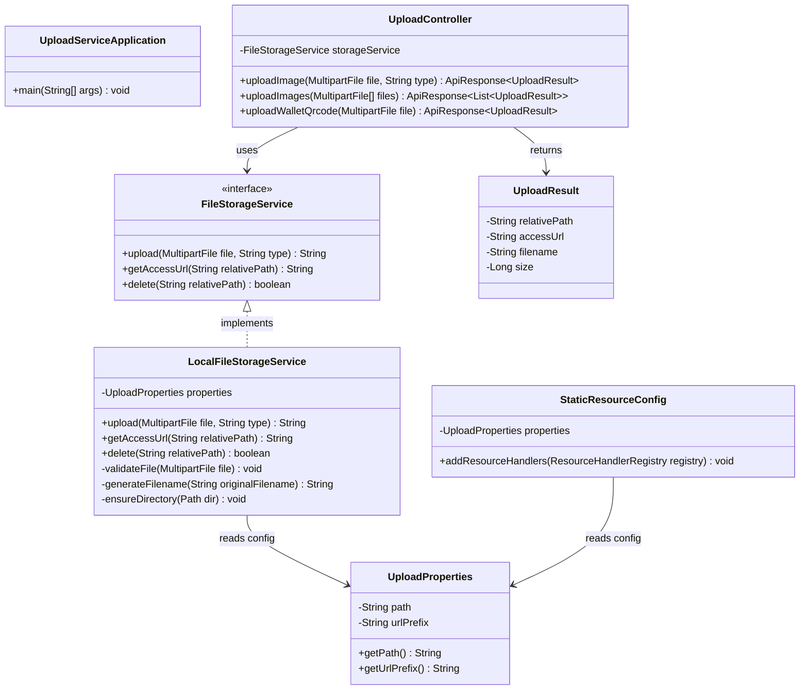
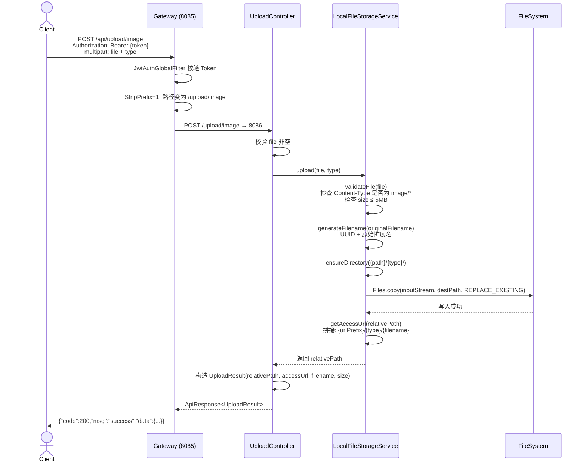
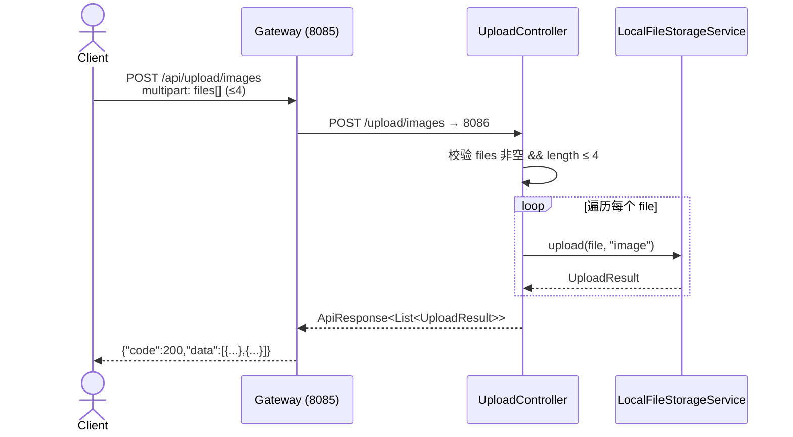
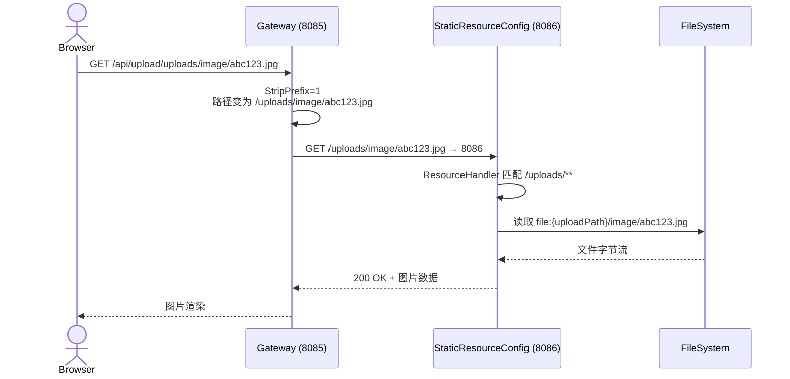
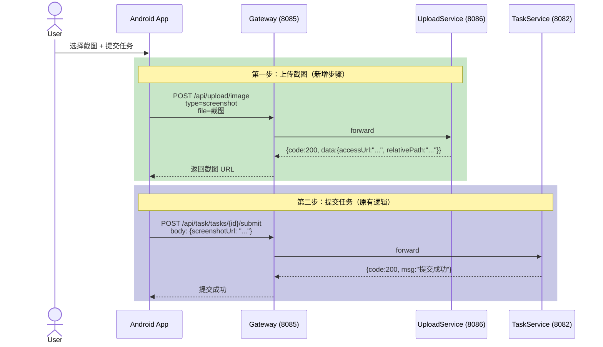
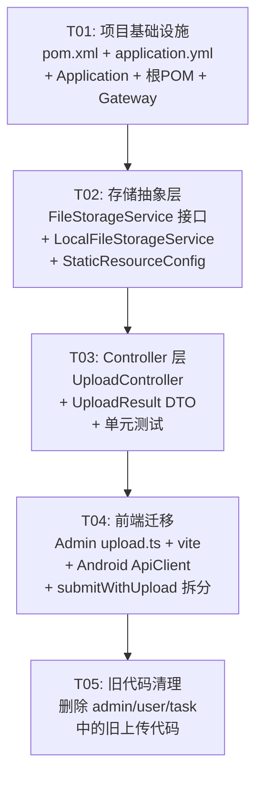

# 统一上传服务 (task-upload-service) — 系统设计文档

> **作者**: Bob (Architect)  
> **日期**: 2025-07-14  
> **版本**: v1.0

---

## Part A: 系统设计

### 1. 实现方案

#### 1.1 核心技术挑战

| 挑战 | 分析 |
|------|------|
| **3 套上传逻辑合并** | admin-api (图片)、user-service (截图+收款码)、task-service (提交+上传) 各自独立实现，需统一到一个服务 |
| **存储抽象** | 当前直接操作本地文件系统，无 OSS 抽象层，需设计可扩展的接口 |
| **URL 体系统一** | 3 个服务返回不同格式的 URL（绝对路径、相对路径、带端口 URL），需统一为一种格式 |
| **前端兼容** | Admin 直连 8084、Android 通过 Gateway，需全部迁移到 Gateway → upload-service |
| **submitWithUpload 拆分** | Android 端当前上传+提交一步完成，需拆为两步：先上传拿 URL，再调用提交接口 |

#### 1.2 框架与库选择

| 技术点 | 选择 | 理由 |
|--------|------|------|
| **Web 框架** | Spring Boot 3.1.5 + spring-boot-starter-web | 与现有服务一致，无需额外学习成本 |
| **文件操作** | `java.nio.file.Files` + `StandardCopyOption` | 替代旧代码中的 `File.transferTo()`，更好的异常处理 |
| **配置绑定** | `@ConfigurationProperties` | 类型安全的配置绑定，替代分散的 `@Value` |
| **工具类** | Hutool `FileUtil` + `StrUtil` | 项目已依赖 Hutool 5.8.25，复用现有能力 |
| **测试** | spring-boot-starter-test + MockMvc | 与现有服务一致 |
| **安全** | 无 Spring Security 依赖 | 鉴权完全由 Gateway `JwtAuthGlobalFilter` 统一处理；upload-service 仅校验文件合法性 |

#### 1.3 架构模式

**分层架构 (Layered Architecture)**：

```
┌──────────────────────────────────────────┐
│  Gateway (8085)                           │
│  JwtAuthGlobalFilter → /api/upload/**     │
│  StripPrefix=1 → forward to 8086          │
└──────────────────┬───────────────────────┘
                   │
┌──────────────────▼───────────────────────┐
│  task-upload-service (8086)               │
│  ┌─────────────────────────────────────┐ │
│  │  Controller 层                       │ │
│  │  UploadController                    │ │
│  ├─────────────────────────────────────┤ │
│  │  Service 层                          │ │
│  │  FileStorageService (接口)           │ │
│  │    ├── LocalFileStorageService       │ │
│  │    └── OssFileStorageService (预留)  │ │
│  ├─────────────────────────────────────┤ │
│  │  Config 层                           │ │
│  │  UploadProperties / StaticResource   │ │
│  └─────────────────────────────────────┘ │
└──────────────────────────────────────────┘
```

---

### 2. 文件列表

所有路径基于 `/Users/luojianwei/Documents/Workbuddy/automation_project/backend/`

```
task-upload-service/
├── pom.xml                                                              # 模块 POM
└── src/
    ├── main/
    │   ├── java/com/task/platform/upload/
    │   │   ├── UploadServiceApplication.java                           # 启动类
    │   │   ├── config/
    │   │   │   ├── UploadProperties.java                               # 上传配置属性类
    │   │   │   └── StaticResourceConfig.java                           # 静态资源映射
    │   │   ├── controller/
    │   │   │   └── UploadController.java                               # 统一上传 Controller
    │   │   ├── storage/
    │   │   │   ├── FileStorageService.java                             # 存储服务接口
    │   │   │   └── LocalFileStorageService.java                        # 本地文件存储实现
    │   │   └── dto/
    │   │       └── UploadResult.java                                   # 上传结果 DTO
    │   └── resources/
    │       └── application.yml                                         # 应用配置
    └── test/
        └── java/com/task/platform/upload/
            └── UploadControllerTest.java                               # 上传接口测试

【修改已有文件】
backend/pom.xml                                                         # 根 POM: 添加 task-upload-service 模块
backend/task-gateway/src/main/resources/application.yml                 # Gateway: 添加 /api/upload/** 路由

【需删除的文件】
backend/task-admin-api/src/main/java/.../controller/UploadController.java       # admin 旧上传 Controller
backend/task-admin-api/src/main/java/.../config/WebConfig.java                   # 移除上传静态资源映射
backend/task-user-service/src/main/java/.../controller/UploadController.java     # user 旧上传 Controller
backend/task-user-service/src/main/java/.../config/StaticResourceConfig.java     # 整个删除
backend/task-task-service/src/main/java/.../config/StaticResourceConfig.java     # 整个删除

【需修改的前端/Android 文件（不在 backend 目录下）】
admin-frontend/src/api/upload.ts                                        # Admin 上传 API
admin-frontend/vite.config.ts                                           # Admin Vite 代理配置
admin-frontend/src/views/task/TaskForm.vue 等                           # Admin 调用点
android/app/.../ApiClient.kt                                            # Android API 客户端
android/app/.../TaskViewModel.kt 等                                     # Android 任务提交流程
android/app/.../WalletBindingScreen.kt                                  # Android 钱包绑定
```

---

### 3. 数据结构与接口



---

### 4. 程序调用流

#### 4.1 单图上传流程



#### 4.2 批量上传流程



#### 4.3 静态资源访问流程



#### 4.4 Android submitWithUpload 拆分流程（改造后）



---

### 5. 暂不明确事项（已做假设）

| # | 不明确点 | 假设/决策 |
|---|---------|----------|
| 1 | `submitWithUpload` 拆分后，task-service 的 `POST /task/tasks/{id}/submit` 是否需要新增 | **是**，需要 task-service 新增或改造一个仅接受 JSON body（含 screenshotUrl）的提交接口。当前 task-service 的 `submitWithUpload` 同时接收 multipart + JSON，拆分后只需 JSON。这属于 task-service 的改动范围，不在 upload-service 内。 |
| 2 | 旧文件是否需迁移到新目录结构 | **不迁移**。新上传的文件使用新目录结构 `{uploadPath}/{type}/`，旧文件仍保留在原路径，通过旧的静态资源映射仍可访问，逐步自然淘汰。 |
| 3 | 腾讯云 COS 的具体配置格式 | **预留接口**。`FileStorageService` 已设计为接口，`OssFileStorageService` 可后续实现。配置通过 `application.yml` 的 `file.upload.storage-type: local|oss` 切换。 |
| 4 | 上传文件大小限制是否统一 | **统一 5MB**。沿用现有 admin-api 和 user-service 的 5MB 限制。批量上传单次最大 20MB（4×5MB）。 |
| 5 | Gateway 是否需为 upload-service 添加特殊 CORS 配置 | **不需要**。Gateway 已有全局 CORS `[/**]` 配置，upload-service 路径自动继承。 |

---

## Part B: 任务分解

### 6. 所需依赖包

```
- spring-boot-starter-web (由 spring-boot-starter-parent 管理版本)
- lombok (由根 POM dependencyManagement 管理)
- hutool-all (由根 POM dependencyManagement 管理, 版本 5.8.25)
- spring-boot-starter-test (test scope)
```

> **注意**：task-upload-service **不需要** MyBatis-Plus、MySQL、Druid、Redis、Spring Security — 它是一个纯文件服务，无数据库依赖。

---

### 7. 任务列表（按依赖排序）

#### T01: 项目基础设施 — task-upload-service 模块骨架

| 属性 | 值 |
|------|-----|
| **Task ID** | T01 |
| **Task Name** | 项目基础设施：模块骨架 + 根POM + Gateway路由 |
| **优先级** | P0 |
| **依赖** | 无 |

**源文件**:

| 操作 | 文件路径 |
|------|---------|
| **新建** | `backend/task-upload-service/pom.xml` |
| **新建** | `backend/task-upload-service/src/main/resources/application.yml` |
| **新建** | `backend/task-upload-service/src/main/java/com/task/platform/upload/UploadServiceApplication.java` |
| **修改** | `backend/pom.xml` — 在 `<modules>` 中添加 `<module>task-upload-service</module>` |
| **修改** | `backend/task-gateway/src/main/resources/application.yml` — 添加 upload-service 路由 |

**验收标准**:
- `mvn clean compile -pl task-upload-service` 通过
- Gateway 路由 `/api/upload/**` → `http://127.0.0.1:8086` 配置生效
- 服务可启动在 8086 端口

---

#### T02: 存储抽象层 — 接口 + 本地实现 + 静态资源

| 属性 | 值 |
|------|-----|
| **Task ID** | T02 |
| **Task Name** | 存储抽象层：FileStorageService 接口 + LocalFileStorageService + StaticResourceConfig |
| **优先级** | P0 |
| **依赖** | T01 |

**源文件**:

| 操作 | 文件路径 |
|------|---------|
| **新建** | `backend/task-upload-service/src/main/java/com/task/platform/upload/config/UploadProperties.java` |
| **新建** | `backend/task-upload-service/src/main/java/com/task/platform/upload/storage/FileStorageService.java` |
| **新建** | `backend/task-upload-service/src/main/java/com/task/platform/upload/storage/LocalFileStorageService.java` |
| **新建** | `backend/task-upload-service/src/main/java/com/task/platform/upload/config/StaticResourceConfig.java` |

**验收标准**:
- `FileStorageService.upload()` 能将文件写入 `{uploadPath}/{type}/{uuid}.{ext}`
- `getAccessUrl()` 返回统一格式的相对路径 `/uploads/{type}/{filename}`
- `delete()` 能正确删除文件
- 静态资源 `/uploads/**` 映射到本地文件系统，可通过浏览器访问已上传文件

---

#### T03: Controller 层 — 统一上传端点

| 属性 | 值 |
|------|-----|
| **Task ID** | T03 |
| **Task Name** | Controller 层：UploadController + UploadResult DTO |
| **优先级** | P0 |
| **依赖** | T02 |

**源文件**:

| 操作 | 文件路径 |
|------|---------|
| **新建** | `backend/task-upload-service/src/main/java/com/task/platform/upload/controller/UploadController.java` |
| **新建** | `backend/task-upload-service/src/main/java/com/task/platform/upload/dto/UploadResult.java` |
| **新建** | `backend/task-upload-service/src/test/java/com/task/platform/upload/UploadControllerTest.java` |

**端点设计**:

| 端点 | 方法 | 参数 | 返回 |
|------|------|------|------|
| `/upload/image` | POST | `file` (MultipartFile), `type` (可选, 默认 "image") | `ApiResponse<UploadResult>` |
| `/upload/images` | POST | `files` (MultipartFile[], ≤4) | `ApiResponse<List<UploadResult>>` |
| `/upload/wallet-qrcode` | POST | `file` (MultipartFile) | `ApiResponse<UploadResult>` |

**验收标准**:
- `POST /upload/image` 上传单张图片成功，返回 `{relativePath, accessUrl, filename, size}`
- `POST /upload/images` 批量上传成功（1-4 张）
- `POST /upload/wallet-qrcode` 上传收款码成功，文件存入 `qrcode/` 子目录
- 文件类型校验（仅 image/*）和大小校验（≤5MB）生效
- 通过 Gateway `/api/upload/image` 可正常访问

---

#### T04: 前端迁移 — Admin 前端 + Android 客户端

| 属性 | 值 |
|------|-----|
| **Task ID** | T04 |
| **Task Name** | 前端迁移：Admin 前端 + Android ApiClient 及 submitWithUpload 拆分 |
| **优先级** | P0 |
| **依赖** | T03 |

**源文件**:

| 操作 | 文件路径 |
|------|---------|
| **修改** | `admin-frontend/src/api/upload.ts` — 端点改为 `/api/upload/image` 和 `/api/upload/images` |
| **修改** | `admin-frontend/vite.config.ts` — 调整 proxy 配置（如需要） |
| **修改** | `admin-frontend/src/views/task/TaskForm.vue` 等 — 调用 upload API 的地方更新 |
| **修改** | `android/.../ApiClient.kt` — `uploadWalletQrcode` 端点改为 `/api/upload/wallet-qrcode` |
| **修改** | `android/.../ApiClient.kt` — 新增 `uploadScreenshot(file): UploadResult` 方法 |
| **修改** | `android/.../WalletBindingScreen.kt` — 调用新的 upload-wallet-qrcode 端点 |
| **修改** | `android/.../TaskViewModel.kt` / `TaskRepository.kt` — `submitWithUpload` 拆为两步：先 `uploadScreenshot()` 再 `submitTask(taskId, screenshotUrl)` |

**验收标准**:
- Admin 前台上传图片功能正常，通过 Gateway 到 upload-service
- Android 收款码上传正常
- Android 任务提交流程：先上传截图 → 拿到 URL → 再提交任务，两步均正常

---

#### T05: 旧代码清理 — 删除旧 Controller + 静态资源配置

| 属性 | 值 |
|------|-----|
| **Task ID** | T05 |
| **Task Name** | 旧代码清理：删除 3 个服务中的上传相关代码 |
| **优先级** | P1 |
| **依赖** | T04（确保前端全部迁移完成后再清理） |

**源文件**:

| 操作 | 文件路径 | 说明 |
|------|---------|------|
| **删除** | `backend/task-admin-api/src/main/java/com/task/platform/admin/controller/UploadController.java` | 整个文件删除 |
| **修改** | `backend/task-admin-api/src/main/java/com/task/platform/admin/config/WebConfig.java` | 删除 `addResourceHandler("/uploads/**")` 相关代码，保留其他 `WebMvcConfigurer` 配置 |
| **删除** | `backend/task-user-service/src/main/java/com/task/platform/user/controller/UploadController.java` | 整个文件删除 |
| **删除** | `backend/task-user-service/src/main/java/com/task/platform/user/config/StaticResourceConfig.java` | 整个文件删除（该文件只有上传映射） |
| **删除** | `backend/task-task-service/src/main/java/com/task/platform/task/config/StaticResourceConfig.java` | 整个文件删除（该文件只有上传映射） |
| **修改** | `backend/task-admin-api/src/main/resources/application.yml` | 移除 `file.upload.path` 和 `file.upload.url-prefix` 配置 |
| **修改** | `backend/task-user-service/src/main/resources/application.yml` | 移除 `file.upload.path` 和 `file.upload.url-prefix` 配置 |

**验收标准**:
- admin-api、user-service、task-service 编译通过（无引用 UploadController 的编译错误）
- 旧上传端点 `/admin/upload/image`、`/user/upload/screenshot`、`/user/upload/wallet-qrcode` 均不可访问
- 新 upload-service 的所有端点正常工作

---

### 8. 共享知识 (Shared Knowledge)

```
【统一响应格式】
所有 API 使用 com.task.platform.common.response.ApiResponse<T>
成功: {"code": 200, "msg": "success", "data": {...}}
失败: {"code": 4xx/5xx, "msg": "错误描述", "data": null}

【鉴权策略】
- upload-service 自身不集成 Spring Security
- 鉴权完全由 Gateway JwtAuthGlobalFilter 处理
- /api/upload/** 不在白名单中 → 所有上传接口需要登录
- Gateway 通过 Header 向下游传递: X-User-Id, X-User-Role（当前 upload-service 不需要使用，预留）

【文件存储规范】
- 存储根路径: {file.upload.path}/{type}/
- type 可选值: image, screenshot, qrcode
- 文件命名: {UUID}{原始扩展名}，如 a1b2c3d4.jpg
- 相对路径格式: /uploads/{type}/{filename}

【URL 生成规则】
- upload() 返回相对路径: /uploads/image/abc.jpg
- getAccessUrl() 返回完整访问 URL: /api/upload/uploads/image/abc.jpg
- 客户端访问: {gateway-host}/api/upload/uploads/image/abc.jpg
  → Gateway StripPrefix=1，变为 /uploads/image/abc.jpg
  → upload-service StaticResourceConfig 映射到本地文件

【文件大小限制】
- 单文件: 5MB (spring.servlet.multipart.max-file-size=5MB)
- 单次请求: 20MB (spring.servlet.multipart.max-request-size=20MB)
- 批量上传: 最多 4 张

【Tomcat 配置】
- max-swallow-size: 10MB (与 admin-api 保持一致)
```

---

### 9. 任务依赖图



---

## 附录

### A. UploadController 端点详细设计

```
POST /upload/image
  Content-Type: multipart/form-data
  Parameters:
    - file: MultipartFile (必填, Content-Type=image/*, size≤5MB)
    - type: String (可选, 默认"image", 可选值: "image"|"screenshot")
  Response: ApiResponse<UploadResult>
  Auth: 需登录（Gateway JWT）
  说明: 替代 admin-api uploadImage + user-service uploadScreenshot

POST /upload/images
  Content-Type: multipart/form-data
  Parameters:
    - files: MultipartFile[] (必填, 1-4个, 每个Content-Type=image/*, size≤5MB)
  Response: ApiResponse<List<UploadResult>>
  Auth: 需登录（Gateway JWT）
  说明: 替代 admin-api uploadImages

POST /upload/wallet-qrcode
  Content-Type: multipart/form-data
  Parameters:
    - file: MultipartFile (必填, Content-Type=image/*, size≤5MB)
  Response: ApiResponse<UploadResult>
  Auth: 需登录（Gateway JWT）
  说明: 替代 user-service uploadWalletQrcode
```

### B. application.yml 完整配置

```yaml
server:
  port: 8086
  tomcat:
    max-swallow-size: 10MB

spring:
  application:
    name: task-upload-service
  servlet:
    multipart:
      max-file-size: 5MB
      max-request-size: 20MB

file:
  upload:
    path: /Users/luojianwei/Documents/Workbuddy/automation_project/uploads
    url-prefix: /api/upload/uploads

logging:
  level:
    com.task.platform.upload: DEBUG
```

### C. Gateway 新增路由配置

```yaml
# 在 task-gateway application.yml 的 spring.cloud.gateway.routes 下新增:

# 文件上传服务路由
- id: task-upload-service
  uri: http://127.0.0.1:8086
  predicates:
    - Path=/api/upload/**
  filters:
    - StripPrefix=1
```
