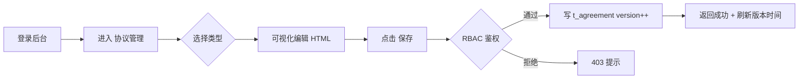

# 简单 PRD：协议文档可视化编辑与 WebView 展示（v1.0）

> 模式：简单 PRD（不含竞品分析，用户未要求）
> 语言：中文
> 作者：产品经理（许清楚）

## 项目信息
- **相关模块**
  - 后端：`task-admin-api`（:8084，RBAC 管理接口）、`task-user-service`（:8081，用户/公开接口）、`task-upload-service`（:8086，图片上传）
  - 管理前端：`frontend/admin-frontend`（Vue 3 + TypeScript + Element Plus 2.x + Pinia）
  - 安卓端：`android/app`（Kotlin 2.0.21 + Jetpack Compose）
- **现有基准事实（已核对代码，非凭空设计）**
  - 后台已有 `SysConfigController`（`task-admin-api/.../controller/SysConfigController.java`），模式为 `@RequestMapping("/admin/settings")` + `@PreAuthorize` + `ApiResponse` 包装，可作为新接口范本。
  - `sys_config` 表 `config_value` 为 `VARCHAR(500)`，**不适合存放大段 HTML** → 建议新建独立表。
  - `task-upload-service` 已有 `UploadController`（:8086），可复用图片上传。
  - 安卓已有 `AboutScreen.kt` / `SettingsScreen.kt` / `ProfileScreen.kt`，路由在 `TaskNavGraph.kt`（`ABOUT="about"`、`SETTINGS="settings"`、`PROFILE="profile"`），导航用 `navController.navigate("about")`。
  - 管理前端已有 `views/settings` 与 `api/settings.ts`，富文本编辑器需新增。
- **原始需求复述**：管理后台需提供「关于我们 / 隐私协议 / 注册协议」三份文档的**可视化 HTML5 富文本编辑**（管理员可编辑并保存 HTML 内容）；安卓端在「关于我们」页面及「设置/我的」中提供入口，点击后使用 WebView 按 HTML5 原样展示对应文档内容。

---

## 一、产品目标
解决「关于我们 / 隐私协议 / 注册协议」三份文档当前在安卓端为硬编码文本、无法由运营/管理员随时更新的问题。通过「后台可视化编辑 + 独立存储 + 安卓 WebView 原样展示」的模式，实现文档内容的集中管理与即时下发，保证两端内容一致、合规可控、无需发版即可变更。

---

## 二、用户故事

### （a）管理员编辑侧
- 作为**管理员**，我希望登录管理后台后进入「协议管理」页，选择文档类型（关于我们 / 隐私协议 / 注册协议），在可视化富文本编辑器里修改内容并保存，以便随时更新对外文档而无需发版。
- 作为**管理员**，我希望保存后能预览实际渲染效果，并看到版本号与更新时间，以便核对内容正确性并追溯变更。

### （b）安卓用户查看侧
- 作为**普通用户**，我在「关于我们」页面或「设置 / 我的」中点击「隐私协议」「注册协议」入口时，期望以 WebView 看到排版良好的 HTML 文档，以便了解平台规则与隐私条款。
- 作为**普通用户**，我期望看到的文档内容是最新版本，以便获知最新的条款变更。

---

## 三、需求池

### P0（Must have）

**P0-1 后台协议管理可视化编辑页**
- 描述：管理后台新增「协议管理」菜单，提供「关于我们 / 隐私协议 / 注册协议」类型切换（Tab / Radio），中部为富文本编辑区，支持基础排版（标题、粗体、列表、链接、图片）并输出标准 HTML。
- 验收：`①` 选中类型编辑后点击「保存」可将 `content_html` 写入数据库；`②` 保存成功有提示；`③` 空内容/超长内容有校验拦截；`④` 编辑器输出为合法 HTML 片段。

**P0-2 独立存储表 `t_agreement`**
- 描述：新建表 `t_agreement`（id, type, title, content_html, version, updated_at, updated_by），替代将大段 HTML 塞入 `sys_config`（其 `config_value` 仅 `VARCHAR(500)`，不适合大文本）。
- 验收：`①` 三份文档各存一行（type ∈ {about, privacy, register}）；`②` `content_html` 为 TEXT/LONGTEXT，可完整保存富文本 HTML；`③` `type` 唯一约束。

**P0-3 后台保存/查询接口（RBAC 鉴权）**
- 描述：在 `task-admin-api` 新增协议管理接口（参照 `SysConfigController` 模式：`@RequestMapping("/admin/agreements")` + `@PreAuthorize`），提供按 type 查询与更新（写入 title/content_html，自增 version，记录 updated_by/updated_at）。
- 验收：`①` 仅授权角色（如 SUPER_ADMIN / MERCHANT_ADMIN）可写；`②` 未授权返回 403；`③` 返回 `ApiResponse` 标准结构。

**P0-4 安卓三入口 + WebView 展示**
- 描述：新增协议展示页 `AgreementScreen`（type 参数化），通过 `AndroidView` 包裹 `WebView` 加载 HTML 字符串（拼接移动端适配 CSS）；入口①「关于我们」页（`AboutScreen`）底部增加按钮跳转；入口②「设置」页（`SettingsScreen`）新增「隐私协议」「注册协议」两项卡片跳转；入口③「我的」（`ProfileScreen`）可选加入同两项。在 `TaskNavGraph.kt` 注册 `composable("agreement/{type}")`。
- 验收：`①` 三个入口均可点击进入对应 type 的 WebView 页；`②` WebView 正确渲染 HTML（图片、链接可点击）；`③` 顶部带标题栏与返回键。

**P0-5 公开 / 匿名 GET 拉取接口**
- 描述：提供无需登录的 GET 接口，按 type 返回协议 HTML 内容（及 version、title、updated_at），安卓端据此加载（协议本应所有人可看）。
- 验收：`①` 未携带 token 也能 200 返回对应 type 的 HTML；`②` type 不存在返回友好空态/默认文案；`③` 非法 type 参数有校验。

### P1（Should have）

**P1-1 富文本图片上传**
- 描述：编辑器内图片上传复用现有 `task-upload-service`（:8086）上传能力，返回 `upload_domain` 前缀的可访问 URL 嵌入 HTML。
- 验收：`①` 编辑器插入图片→上传→得到 `upload_domain` 前缀 URL；`②` 保存后在安卓 WebView 中可见该图片。

**P1-2 版本号自增 + 更新时间**
- 描述：每次保存 version 自增（或从 1 起），`updated_at` 自动刷新；后台管理页展示当前版本号与最近更新时间；安卓展示页可在标题栏/底部展示「更新于 xxx」。
- 验收：`①` 连续保存两次 version 递增；`②` 管理页与接口均返回最新 version/updated_at。

**P1-3 版本/时间在前后端展示**
- 描述：后台协议管理页显示每类文档「版本 vX · 更新于 YYYY-MM-DD HH:mm」；安卓协议页底部展示同样信息。
- 验收：字段可见且与实际存储一致。

### P2（Nice to have）

**P2-1 协议变更安卓端提示 / 版本校验**
- 描述：安卓端记录本地已读版本号，进入相关页面或启动时若远程 version 大于本地，提示「协议已更新，请重新阅读」或角标提示。
- 验收：仅当 version 变化才提示；用户阅读后更新本地记录。

**P2-2 后台预览效果**
- 描述：后台编辑页提供「预览」按钮，以只读方式按移动端/桌面样式渲染当前 HTML，便于发布前核对。
- 验收：预览所见与安卓 WebView 渲染基本一致。

---

## 四、UI 设计稿

### （a）管理后台「协议管理」编辑页
顶部类型切换 Tab + 中部富文本编辑区 + 信息栏 + 操作按钮。

```
┌──────────────────────────────────────────────────────────────┐
│  协议管理                                            [预览][保存]│
├──────────────────────────────────────────────────────────────┤
│  [ 关于我们 ]  [ 隐私协议 ]  [ 注册协议 ]   ← 类型切换 Tab      │
├──────────────────────────────────────────────────────────────┤
│  标题：[____________________________________________________] │
│  ┌────────────────────────────────────────────────────────┐ │
│  │  工具栏： B I U  列表  链接  图片  引用  清除格式         │ │
│  ├────────────────────────────────────────────────────────┤ │
│  │                                                          │ │
│  │      （wangEditor / Quill 可视化编辑区，输出标准 HTML）   │ │
│  │                                                          │ │
│  └────────────────────────────────────────────────────────┘ │
│  当前版本：v3 · 更新于 2025-07-12 21:44 · 操作人：admin        │
└──────────────────────────────────────────────────────────────┘
```

编辑保存流程（Mermaid）：


### （b）安卓端协议展示页（AgreementScreen）
```
┌──────────────────────────────┐
│  ←  隐私协议            (⋮)  │  ← 顶部标题栏（标题 = 协议 title）
├──────────────────────────────┤
│                              │
│   WebView 内容区             │  ← AndroidView 包裹 WebView
│   - 标题 / 段落 / 列表        │     加载 HTML 字符串 + 移动端 CSS
│   - 图片（来自 upload_domain）│
│   - 链接可点击               │
│                              │
├──────────────────────────────┤
│  更新于 2025-07-12 21:44 v3  │  ← 底部版本/时间（可选）
└──────────────────────────────┘
```
导航：`SettingsScreen` 新增「隐私协议 / 注册协议」卡片 → `navController.navigate("agreement/privacy|register")`；`AboutScreen` 底部按钮 → `agreement/about`；`TaskNavGraph.kt` 注册 `composable("agreement/{type}")`。

---

## 五、待确认问题（需架构师 / 用户拍板，⚠ 标注）

1. ⚠ **可视化编辑器选型**：推荐 **wangEditor**（中文友好、轻量、输出标准 HTML，与 Element Plus 易集成）；备选 Quill（国际化更好、定制性强但中文体验略弱）。请最终拍板。
2. ⚠ **存储方案**：推荐新建独立表 **`t_agreement`**（type / title / content_html / version / updated_at / updated_by），而非写入 `sys_config`（其 `config_value` 仅 `VARCHAR(500)`，不适合大段 HTML）。请确认。
3. ⚠ **公开 GET 接口归属**：推荐放在 `task-user-service`（:8081）暴露匿名端点（如 `GET /api/user/agreements/{type}` 或 `/api/public/agreements/{type}`），由网关放行无需登录；后台写接口仍在 `task-admin-api`（:8084）走 RBAC。需确认接口模块归属、网关放行策略，以及 `t_agreement` 表的多模块访问方式（共用库 / 只读映射）。
4. ⚠ **安卓是否需离线缓存协议**：建议默认不缓存（P0 每次拉取最新），离线缓存作为 P2 选项。请确认首屏/弱网下是否缓存到本地（DataStore / Room）。
5. ⚠ **协议更新后安卓如何感知**：方案 A——每次进入协议页 / App 启动时拉取最新 version 比对（简单，推荐）；方案 B——后台推送 / 版本接口轮询。请确认采用 A 还是 B（影响 P2-1 实现）。
6. ⚠ **图片上传复用确认**：确认富文本图片上传直接复用 `task-upload-service`（:8086）现有 `UploadController`，并统一使用 `sys_config.upload_domain` 拼接图片 URL（与现有上传逻辑一致）。
