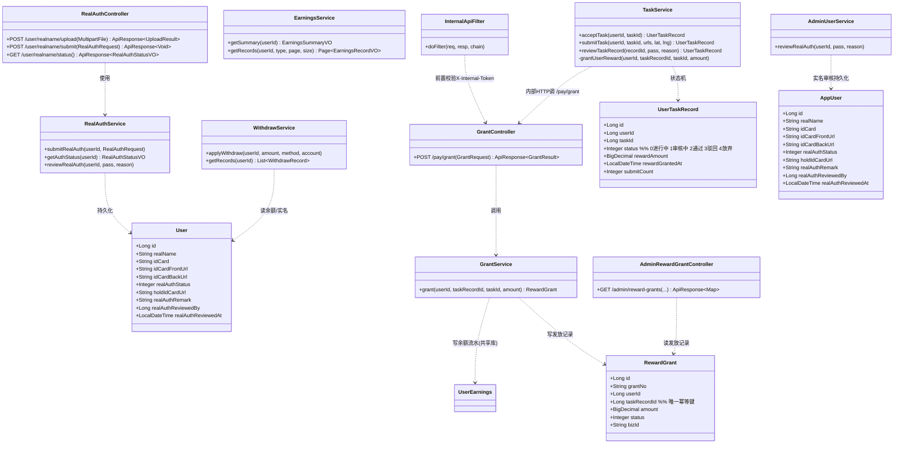
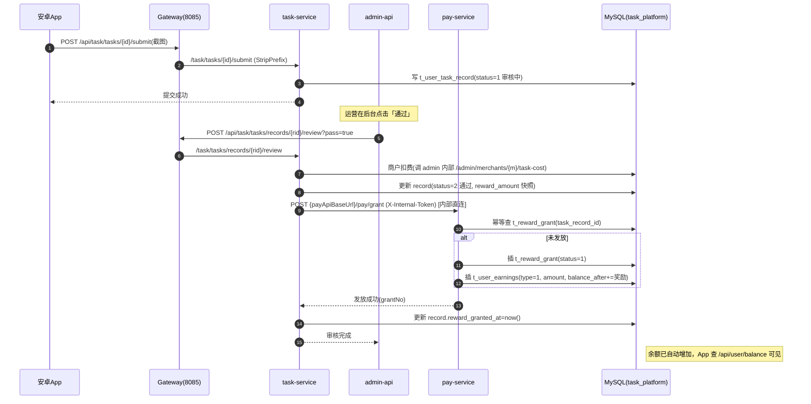
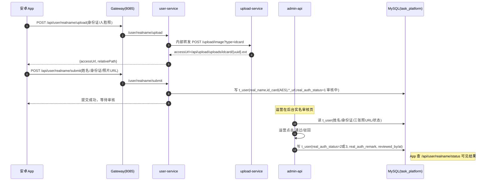
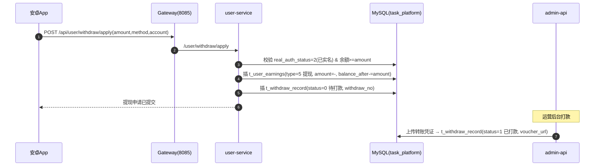
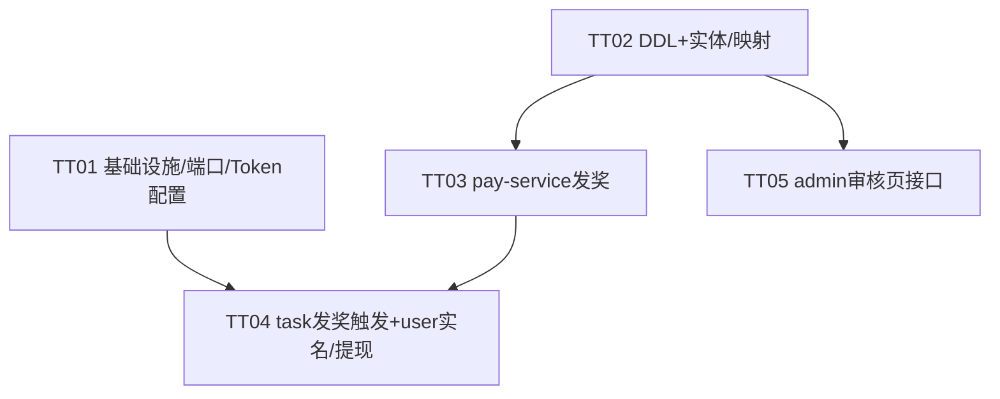

# 后端 Stub 补全 + 端口冲突修复 —— 系统架构设计文档

> 文档作者：高见远（software-architect / Bob）
> 对应 PRD：`docs/prd-backend-stubs.md`
> 技术栈：Spring Boot 3.1.5 / Java 17 / MyBatis-Plus 3.5.7 / Spring Security + JWT / Spring Cloud Gateway 2022.0.4 / Redis / MySQL 8.0
> 落盘日期：2025-07（本期权）

---

## 摘要（给主理人/工程师中转用）

本期在既有多模块微骨架上**补全 5 项 stub 缺口 + 修复端口冲突**，跑通「接任务→提交截图→人工审核→系统自动发奖→收益/提现」与「实名提交+人工审核」闭环。

**结论速览（已探明，减少返工）：**
1. 统一返回体在代码里实际叫 `ApiResponse<T>`（PRD 写的 `Result<T>` 是笔误，以代码为准）。
2. **余额无独立表**：余额 = `t_user_earnings` 最新一条 `balance_after`；user-service、admin-api 都这么读。PRD 列的「用户余额表」由 `t_user_earnings` 充当，不加新表。
3. **奖励金额来自 `t_task.reward_amount`**（每任务配置，发布时写入），审核时快照到 `t_user_task_record.reward_amount`（该字段已存在）。无需 sys_config。
4. **发奖 stub 位置已定位**：`task-task-service` 的 `TaskService.reviewTaskRecord` 在 pass 分支有 `// TODO: 调用支付服务发放奖励`，且已写好商户扣费。本期把该 TODO 填成「调 pay-service `/pay/grant`」。
5. **admin-api 的 `AdminTaskRecordController.approve` 也已实现发奖**（直接写 `t_user_earnings`）——存在「双审核入口」风险，见 §8 待明确 #1，需确立 pay-service 为唯一发奖权威。
6. **上传本地化基本已完成**：`LocalFileStorageService` 落地本地磁盘、返回完整 `accessUrl`（`/api/upload/uploads/{type}/{uuid}.ext`），与安卓 `rewriteLocalImageUrl` 替换 host 约定一致。本期仅需在 user-service 补一个 `realname/upload` 转发端点。
7. **端口冲突精确改动点已核对**（见 §2 / §5-T01）：task-service 主 yml `8083→8082`；pay-service 主+dev `8083→8087`；gateway 中 `task-pay-service` 路由 `8083→8087`。

**依赖拓扑重要事实**：所有微服务在配置里 `url` 都指向同一个 MySQL 库 `task_platform`（仅 host 不同：user/task 用 `118.145.198.135`，pay 用 `localhost`）。即**物理上是一库多服务**，不是真正的两库分布式事务。因此「发奖一致性」按「共享库 + 各服务各自 mapper + 幂等 + 补偿」实现，不强求分布式事务（与 PRD 建议一致）。

---

## 1. 实现方案 + 框架选型

### 1.1 技术难点与选型
| 难点 | 选型 / 方案 | 理由 |
|---|---|---|
| 服务间调用（task→pay 发奖） | **直连内网 + `X-Internal-Token` 请求头校验**（不走网关 JWT） | 与既有 `TaskService.deductMerchantBalance` 调 admin 内部接口（`admin.api.base-url` + `X-Internal-Token`）完全一致的约定；绕过网关 JWT 鉴权，避免 `/api/pay/grant` 被网关拦截 |
| 发奖一致性（跨 task / pay 两服务） | **最终一致**：pay-service 本地事务写 `t_reward_grant` + `t_user_earnings`；`task_record_id` 唯一约束做幂等；失败由定时补偿任务重试 | 共享同一 MySQL 库，无需 Seata 等分布式事务；幂等键防双发 |
| 余额存储 | 复用既有「`t_user_earnings.balance_after` 最新值即余额」模型，**不新增余额表** | 与 `WithdrawService` / `EarningsService` / `AdminUserController` 既有读取方式零改动，风险最低 |
| 文件存储（截图/证件） | 复用 `LocalFileStorageService`（本地磁盘），预留 `OssFileStorageService` | 安卓 `rewriteLocalImageUrl` 已按 `accessUrl` 替换 host；本期不接云 |
| 统一返回 / 异常 | 复用 `task-common` 的 `ApiResponse<T>` + `ErrorCode` + `BusinessException` + `GlobalExceptionHandler` | 全项目已统一 |
| 内部 Token 常量 | 复用既有共享密钥 `task-internal-2026`（`task-task-service` 的 `internal.api-token`） | 与现有 admin 内部调用同源 |

### 1.2 架构模式
- **分层**：Controller（路由/鉴权入口）→ Service（业务逻辑/事务）→ Mapper（MyBatis-Plus）→ MySQL（共享库 `task_platform`）。
- **网关**：Spring Cloud Gateway 统一入口（8085），`StripPrefix=1` 去掉 `/api`；JWT 全局过滤，登录态通过 `X-User-Id` / `X-User-Role` 透传下游。
- **内部调用**：服务间（task→pay、task→admin）走**内网直连 RestTemplate + `X-Internal-Token`**，不经网关。
- **事务边界**：每个服务各自 `@Transactional` 本地事务；跨服务的「审核通过 + 发奖」用「先落本地状态、再调内部接口、失败补偿」实现最终一致。

---

## 2. 文件列表及相对路径

> 相对路径以 `backend/` 为根。包名统一 `com.task.platform.*`。

### 2.1 基础设施 / 配置（T01）
| 文件 | 模块 | 操作 | 用途 |
|---|---|---|---|
| `task-task-service/src/main/resources/application.yml` | task-task-service | MODIFY | ① 端口 `port: 8083` → `8082`（修复冲突）② 新增 `pay.api.base-url: http://localhost:8087` |
| `task-pay-service/src/main/resources/application.yml` | task-pay-service | MODIFY | 端口 `port: 8083` → `8087`；新增 `internal.api-token: task-internal-2026`、`jwt.secret`（同享密钥）、`app.upload-domain`（可选） |
| `task-pay-service/src/main/resources/application-dev.yml` | task-pay-service | MODIFY | 端口 `port: 8083` → `8087` |
| `task-gateway/src/main/resources/application.yml` | task-gateway | MODIFY | `id: task-pay-service` 路由 `uri: http://127.0.0.1:8083` → `http://127.0.0.1:8087`（约第 41 行） |

### 2.2 数据库 DDL + 实体 / 映射（T02）
| 文件 | 模块 | 操作 | 用途 |
|---|---|---|---|
| `docs/sql/backend-stubs-ddl.sql` | — | NEW | `t_reward_grant` 建表；`t_user` 加证件/审核备注列；`t_user_earnings` 加 `biz_id` |
| `task-pay-service/.../entity/RewardGrant.java` | task-pay-service | NEW | `t_reward_grant` 实体 |
| `task-pay-service/.../mapper/RewardGrantMapper.java` | task-pay-service | NEW | `t_reward_grant` 映射 + `selectByTaskRecordId` |
| `task-pay-service/.../mapper/UserEarningsMapper.java` | task-pay-service | NEW | 镜像 user-service 的 earnings 映射（`selectLatestBalance` + `insert`） |
| `task-user-service/.../entity/User.java` | task-user-service | MODIFY | 新增 `holdIdCardUrl` / `realAuthRemark` / `realAuthReviewedBy` / `realAuthReviewedAt` |
| `task-admin-api/.../entity/AppUser.java` | task-admin-api | MODIFY | 同步新增上述 4 个字段（admin 侧读 `t_user`） |

### 2.3 pay-service 发奖能力（T03）
| 文件 | 模块 | 操作 | 用途 |
|---|---|---|---|
| `task-pay-service/.../controller/GrantController.java` | task-pay-service | NEW | `POST /pay/grant`，校验 `X-Internal-Token` 后调 GrantService |
| `task-pay-service/.../service/GrantService.java` | task-pay-service | NEW | 幂等发奖：写 `t_reward_grant` + 写 `t_user_earnings`（余额 += 奖励） |
| `task-pay-service/.../security/InternalApiFilter.java` | task-pay-service | NEW | 对 `/pay/**` 内部端点校验 `X-Internal-Token`，非法直接 401 |
| `task-pay-service/.../PayServiceApplication.java` | task-pay-service | MODIFY（可选） | 确认 `@MapperScan("com.task.platform.pay.mapper")` 或 mapper 接口加 `@Mapper` |

### 2.4 task-service 发奖触发 + user-service 实名/提现（T04）
| 文件 | 模块 | 操作 | 用途 |
|---|---|---|---|
| `task-task-service/.../service/TaskService.java` | task-task-service | MODIFY | `reviewTaskRecord` 填 TODO→调 `grantUserReward`（内部 RestTemplate 调 pay）；`submitTask` 允许驳回后重提（status∈{0,3}，submitCount 上限 2）；新增 `grantUserReward` + `payApiBaseUrl` 注入 |
| `task-task-service/.../security/SecurityConfig.java` | task-task-service | MODIFY（可选） | review 端点建议仅限内部/管理员（见 §8） |
| `task-user-service/.../controller/RealAuthController.java` | task-user-service | MODIFY | 路径 `/user/real-auth` → `/user/realname`；方法改为 `upload` / `submit` / `status`（对齐安卓）；`upload` 内部转发 upload-service 取 `accessUrl` |
| `task-user-service/.../service/RealAuthService.java` | task-user-service | MODIFY | `submitRealAuth` 持久化 `holdIdCardUrl` 到 `t_user.hold_id_card_url` |
| `task-user-service/.../service/WithdrawService.java` | task-user-service | MODIFY | 去掉最低提现门槛（读 `min_withdraw_amount`，0 视为无门槛）；提现记录初始 `status=0`（待打款）；earnings `type` 用 `5`（提现）取代现有 `3`，避免与「邀请返佣」混淆 |
| `task-user-service/.../service/EarningsService.java` | task-user-service | MODIFY（可选） | 收益明细 `type` 标签补充 `5=提现`；其余已可用 |
| `task-user-service/.../entity/User.java` | task-user-service | MODIFY | 见 2.2（与 T02 同文件） |

### 2.5 admin 审核页接口（T05）
| 文件 | 模块 | 操作 | 用途 |
|---|---|---|---|
| `task-admin-api/.../controller/AdminRewardGrantController.java` | task-admin-api | NEW | `GET /admin/reward-grants` 奖励发放记录列表（PRD 4.3） |
| `task-admin-api/.../controller/AdminUserController.java` | task-admin-api | MODIFY | `getRealAuthDetail` 返回 `holdIdCardUrl` / `realAuthRemark` / `realAuthReviewedAt` |
| `task-admin-api/.../service/AdminUserService.java` | task-admin-api | MODIFY | `reviewRealAuth` 持久化 `real_auth_remark` + `real_auth_reviewed_by` + `real_auth_reviewed_at` |
| `task-admin-api/.../entity/AppUser.java` | task-admin-api | MODIFY | 见 2.2（与 T02 同文件） |

> 说明：**upload-service 本期基本无需改动**（本地存储 + 返回 accessUrl 已就绪）。实名图片上传走 user-service `/user/realname/upload` 转发到 upload-service（`type=idcard`），由 upload-service 经网关静态服务，URL 格式与安卓约定一致。

---

## 3. 数据结构和接口（类图 + 表结构）

### 3.1 新增 / 修改数据库表

#### (a) `t_reward_grant`（NEW，pay-service 拥有，发奖对账表）
```sql
CREATE TABLE IF NOT EXISTS t_reward_grant (
  id             BIGINT       NOT NULL AUTO_INCREMENT PRIMARY KEY,
  grant_no       VARCHAR(32)  NOT NULL                COMMENT '发放单号 RG+yyyymmddHHmmss+rand',
  user_id        BIGINT       NOT NULL                COMMENT '用户ID',
  task_id        BIGINT       NULL                    COMMENT '任务ID',
  task_record_id BIGINT       NOT NULL                COMMENT '用户任务记录ID（幂等键）',
  amount         DECIMAL(12,2) NOT NULL             COMMENT '奖励金额',
  status         TINYINT      NOT NULL DEFAULT 1      COMMENT '1已发放 2失败',
  biz_id         VARCHAR(64)  NULL                  COMMENT '业务幂等键（同 task_record_id）',
  created_at     DATETIME     NOT NULL DEFAULT CURRENT_TIMESTAMP,
  granted_at     DATETIME     NULL,
  UNIQUE KEY uk_task_record (task_record_id)
) ENGINE=InnoDB DEFAULT CHARSET=utf8mb4 COMMENT='任务奖励发放记录表';
```

#### (b) `t_user`（EXISTING，实名审核字段扩展）
```sql
ALTER TABLE t_user
  ADD COLUMN hold_id_card_url     VARCHAR(512) NULL COMMENT '手持身份证照URL' AFTER id_card_back_url,
  ADD COLUMN real_auth_remark     VARCHAR(255) NULL COMMENT '实名审核备注/驳回原因' AFTER real_auth_status,
  ADD COLUMN real_auth_reviewed_by BIGINT      NULL COMMENT '审核人ID',
  ADD COLUMN real_auth_reviewed_at DATETIME    NULL COMMENT '审核时间';
```

#### (c) `t_user_earnings`（EXISTING，加业务追溯键）
```sql
ALTER TABLE t_user_earnings
  ADD COLUMN biz_id VARCHAR(64) NULL COMMENT '业务关联键（发放单号/提现单号）' AFTER remark;
-- 说明：type 取值约定（与既有一致，本期修正提现取值）
-- 1任务奖励 2广告奖励 3邀请返佣 4新手任务奖励 【5提现（本期修正，原代码误用3）】
-- 余额 = status=1 的最新一条 balance_after
```

#### (d) `t_user_task_record`（EXISTING，状态机）
- `status`：0 进行中/待提交 → 1 审核中 → 2 通过 → 3 驳回 →（超时/放弃）4
- 已有 `reward_amount`、`reward_granted_at`、`submit_count` 等字段，无需 DDL。

#### (e) `t_withdraw_record`（EXISTING，仅语义调整，无 DDL）
- 本期语义：`0=待打款` `1=已打款` `2=已拒绝`（去掉「待审核」中间态，契合「无门槛随时提」）。
- `applyWithdraw` 创建时 `status=0`（待打款）；admin 上传凭证即 `1`（已打款）。

#### (f) `t_task`（EXISTING，奖励来源）
- 已有 `reward_amount` 字段（发布时写入）→ 即为奖励金额来源，无需新增。

### 3.2 核心 Java 类 / 接口签名（新增 & 关键修改）



### 3.3 关键接口签名（伪代码，供工程师实现）

**pay-service — `GrantController`**
```java
@RestController
@RequestMapping("/pay")
@RequiredArgsConstructor
public class GrantController {
    private final GrantService grantService;
    @PostMapping("/grant")
    public ApiResponse<GrantService.GrantResult> grant(@RequestHeader("X-Internal-Token") String token,
                                                       @RequestBody GrantRequest req) {
        // token 已由 InternalApiFilter 校验通过
        return ApiResponse.success(grantService.grant(req.getUserId(), req.getTaskRecordId(),
                req.getTaskId(), req.getAmount()));
    }
    @Data public static class GrantRequest {
        private Long userId; private Long taskRecordId; private Long taskId; private BigDecimal amount;
    }
}
```

**pay-service — `GrantService`（幂等发奖）**
```java
@Service @RequiredArgsConstructor @Slf4j
public class GrantService {
    private final RewardGrantMapper grantMapper;
    private final UserEarningsMapper earningsMapper;   // pay 侧镜像 mapper

    @Transactional(rollbackFor = Exception.class)
    public GrantResult grant(Long userId, Long taskRecordId, Long taskId, BigDecimal amount) {
        // 1. 幂等：同一 taskRecordId 只发一次
        if (grantMapper.selectByTaskRecordId(taskRecordId) != null) {
            return new GrantResult(true, "已发放"); // 幂等返回
        }
        // 2. 计算新余额
        BigDecimal prev = Optional.ofNullable(earningsMapper.selectLatestBalance(userId)).orElse(BigDecimal.ZERO);
        BigDecimal after = prev.add(amount);
        // 3. 写发放记录（status=1 已发放）
        RewardGrant g = new RewardGrant(); /* 填充 userId/taskRecordId/taskId/amount/grantNo/grantedAt */
        grantMapper.insert(g);
        // 4. 写余额流水（type=1 任务奖励）
        UserEarnings e = new UserEarnings(); /* userId/type=1/amount/balanceAfter=after/status=1/bizId=g.grantNo/relatedId=taskRecordId */
        earningsMapper.insert(e);
        return new GrantResult(true, g.getGrantNo());
    }
}
```

**task-service — `TaskService.grantUserReward`（填 TODO）**
```java
@Value("${pay.api.base-url:http://localhost:8087}") private String payApiBaseUrl;
@Value("${internal.api-token:}") private String internalApiToken;
private static final RestTemplate REST = new RestTemplate();

private void grantUserReward(Long userId, Long taskRecordId, Long taskId, BigDecimal amount) {
    try {
        String url = payApiBaseUrl + "/pay/grant";
        HttpHeaders h = new HttpHeaders();
        h.setContentType(MediaType.APPLICATION_JSON);
        h.set("X-Internal-Token", internalApiToken);
        Map<String,Object> body = Map.of("userId",userId,"taskRecordId",taskRecordId,"taskId",taskId,"amount",amount);
        ResponseEntity<String> r = REST.postForEntity(url, new HttpEntity<>(body,h), String.class);
        if (!r.getStatusCode().is2xxSuccessful()) throw new BusinessException(ErrorCode.SYSTEM_ERROR, "发奖失败");
    } catch (BusinessException e) { throw e; }
    catch (Exception e) { log.error("调用 pay 发奖失败", e); throw new BusinessException(ErrorCode.SYSTEM_ERROR, "发奖调用失败"); }
}
// 在 reviewTaskRecord 的 pass 分支、deductMerchantBalance 成功后调用；成功则 record.setRewardGrantedAt(now())
```

---

## 4. 程序调用流程（时序图，Mermaid）

### 4.1 链路一：任务提交 → 人工审核 → 系统自动发奖


### 4.2 链路二：实名提交 → 人工审核


### 4.3 链路三：提现申请（无门槛）


---

## 5. 任务列表（有序、含依赖关系，按实现顺序）

> 规则：≤5 个任务、按功能/层次分组、每个任务 ≥3 文件、T01 为基础设施、任务间尽量只依赖 T01。

| Task | 名称 | 源文件（模块） | 依赖 | 优先级 |
|---|---|---|---|---|
| **T01** | 项目基础设施 & 端口/路由/Token 配置修复 | `task-task-service/application.yml`、`task-pay-service/application.yml`、`task-pay-service/application-dev.yml`、`task-gateway/application.yml` | 无 | P0 |
| **T02** | 数据库 DDL + 实体/映射补全 | `docs/sql/backend-stubs-ddl.sql`、`task-pay-service/entity/RewardGrant.java`、`task-pay-service/mapper/RewardGrantMapper.java`、`task-pay-service/mapper/UserEarningsMapper.java`、`task-user-service/entity/User.java`、`task-admin-api/entity/AppUser.java` | 无 | P0 |
| **T03** | pay-service 发奖能力（新增） | `task-pay-service/controller/GrantController.java`、`task-pay-service/service/GrantService.java`、`task-pay-service/security/InternalApiFilter.java`（实体/mapper 已在 T02） | T02 | P0 |
| **T04** | task-service 发奖触发 + 状态机 + user-service 实名/提现 | `task-task-service/service/TaskService.java`、`task-user-service/controller/RealAuthController.java`、`task-user-service/service/RealAuthService.java`、`task-user-service/service/WithdrawService.java`、`task-user-service/service/EarningsService.java` | T01, T03 | P0 |
| **T05** | admin 审核页接口（奖励发放记录 + 实名备注） | `task-admin-api/controller/AdminRewardGrantController.java`、`task-admin-api/controller/AdminUserController.java`、`task-admin-api/service/AdminUserService.java`（AppUser 已在 T02） | T02 | P1 |

### 5.1 依赖关系图


### 5.2 实现顺序建议
1. **T01**：先改端口/路由/Token 配置，消除冲突，确保服务能起。
2. **T02**：建 `t_reward_grant`、扩 `t_user`/`t_user_earnings`、补实体与 mapper（编译基础）。
3. **T03**：pay-service 发奖（权威发奖入口）。
4. **T04**：task-service 审核接发奖 + 驳回重提状态机；user-service 实名路径对齐 + 提现无门槛。
5. **T05**：admin 奖励发放记录列表 + 实名审核备注持久化。

---

## 6. 依赖包列表

本期**无需新增 Maven 依赖**。所有需要的库已在根 `pom.xml` 的 `dependencyManagement` 中声明，子模块直接引用即可：
- `spring-boot-starter-web`（含 `RestTemplate`）—— task-task-service / task-pay-service 已依赖。
- `mybatis-plus-boot-starter`（3.5.7）—— pay-service 已有（其 `application.yml` 已配 MyBatis-Plus）。
- `spring-boot-starter-security` / `jjwt`（0.12.3）—— pay-service 加 `InternalApiFilter` 时引用（JWT 密钥复用 `task-common.JwtUtil` 同享常量，无需新依赖）。
- `hutool-all`（5.8.25）—— 上传/工具类复用。
- `mysql-connector-j`（8.0.33）、`druid-spring-boot-starter`（1.2.20）—— 数据源。

> 唯一注意：pay-service 现有 `application.yml` 已排除/未排除 DataSource？——**已配 `datasource` + MyBatis-Plus**（见其 yml），故可直接建 mapper，无需额外依赖。

---

## 7. 共享知识（跨文件约定）

1. **统一返回体**：`ApiResponse<T>`（`task-common`），字段 `{code, msg, data, timestamp}`。`code=200` 成功；错误用 `ApiResponse.error(ErrorCode)` 或 `error(code, msg)`。**注意：PRD 写的 `Result<T>` 是笔误，实为 `ApiResponse<T>`。**
2. **统一异常**：业务异常抛 `BusinessException(ErrorCode)`；由 `GlobalExceptionHandler` 统一转 `ApiResponse`。
3. **错误码复用**：提现/余额相关已定义 `INSUFFICIENT_BALANCE(5000)`、`REAL_NAME_AUTH_REQUIRED(3002)` 等；新增发奖失败可用 `SYSTEM_ERROR(9000)` 或新增 `GRANT_FAILED(5006)`（可选，写在 `task-common.ErrorCode`）。
4. **内部 Token 常量**：`X-Internal-Token: task-internal-2026`（共享密钥，定义在 `task-task-service` 的 `internal.api-token`，pay-service 校验同值）。**所有内部服务间调用都带此头**。
5. **JWT 密钥**：全服务共享 `TaskPlatformSecretKey2026@AutoTask#$%^&*()_+1234567890`（`task-common.JwtUtil.SECRET` 与各处 `jwt.secret` 一致）。
6. **URL 返回约定**：上传/图片一律返回**完整 accessUrl** = `/api/upload/uploads/{type}/{uuid}.ext`（由 `LocalFileStorageService.getAccessUrl` 生成），安卓端 `rewriteLocalImageUrl` 把 `localhost/127.0.0.1` 替换为 `UPLOAD_BASE_URL` host。**不要返回裸相对路径给客户端。**
7. **状态枚举命名（统一约定，避免各服务各写一套）**：
   - 用户任务记录 `UserTaskRecord.status`：`0 进行中/待提交`、`1 审核中`、`2 通过`、`3 驳回`、`4 超时/放弃`。
   - 实名 `real_auth_status`（t_user）：`0 未认证`、`1 审核中`、`2 已认证`、`3 失败`。
   - 提现 `t_withdraw_record.status`：`0 待打款`、`1 已打款`、`2 已拒绝`。
   - 发奖 `t_reward_grant.status`：`1 已发放`、`2 失败`。
   - 收益流水 `t_user_earnings.type`：`1 任务奖励`、`2 广告奖励`、`3 邀请返佣`、`4 新手任务`、`5 提现`。
8. **余额真相**：`t_user_earnings` 中 `status=1` 的最新一条 `balance_after` 即用户余额；任何加/减余额都必须 `INSERT` 一条 `t_user_earnings` 流水（type 区分），不得 `UPDATE` 用户表余额字段。
9. **幂等键**：发奖以 `t_reward_grant.task_record_id`（唯一约束）防双发；提现单号 `withdraw_no = "WD" + yyyyMMddHHmmss + 6位UUID`。
10. **Gateway 路径**：外部 `/api/{svc}/**` → 下游 `/{svc}/**`（`StripPrefix=1`）；下游 SecurityConfig 必须匹配**去前缀后**的路径（如 task-service 配 `/task/**`）。

---

## 8. 待明确事项（设计决策与需拍板点）

### 8.1 已替你拍板的设计决策（理由附后）
1. **服务间调用鉴权**：采用**内网直连 + `X-Internal-Token`**（不走网关 JWT）。理由：与既有 `TaskService.deductMerchantBalance`→`admin.api.base-url`+`X-Internal-Token` 完全一致；网关 `JwtAuthGlobalFilter` 会对 `/api/pay/**` 要求 JWT，直连可绕开。pay-service 用 `InternalApiFilter` 校验该头。
2. **奖励金额来源**：`t_task.reward_amount`（每任务配置，发布写入）→ 审核时快照到 `t_user_task_record.reward_amount`。**不引入 sys_config**。理由：字段已存在、语义清晰、运营发布时即可配置。
3. **任务提交状态机**：`0 进行中 → 1 审核中 → 2 通过 / 3 驳回`；**驳回后允许重提一次**（submitTask 允许 `status∈{0,3}`，`submitCount` 上限 2）；超时→`4`。理由：契合 PRD「允许重提一次」且与 `AdminTaskRecordController.reject`（回退进行中）一致。
4. **上传返回**：返回**完整 accessUrl**（`/api/upload/uploads/...`）。理由：与安卓 `rewriteLocalImageUrl` 替换 host 约定一致，已落地。
5. **实名作为提现前置**：**是**——`real_auth_status=2` 才允许提现。理由：`WithdrawService.applyWithdraw` 已校验 `realAuthStatus!=2` 拦截，与 PRD 一致，保持即可。
6. **端口冲突修复（已核对实际 yml）**：
   - `task-task-service/src/main/resources/application.yml` 第 2 行 `port: 8083` → **`8082`**
   - `task-pay-service/src/main/resources/application.yml` 第 2 行 `port: 8083` → **`8087`**
   - `task-pay-service/src/main/resources/application-dev.yml` 第 2 行 `port: 8083` → **`8087`**
   - `task-gateway/src/main/resources/application.yml` `id: task-pay-service` 路由 `uri: http://127.0.0.1:8083` → **`http://127.0.0.1:8087`**
   - 修复后：task-service(8082) / pay-service(8087) / gateway 路由三者一致，dev 与 main 均不冲突。

### 8.2 需用户/主理人拍板或注意的点
- **#1（最重要）审核入口唯一性 / 双发风险**：代码里存在**两个审核发奖入口**——
  - (A) `task-task-service` 的 `UserTaskController.reviewTaskRecord`（`/api/task/tasks/records/{id}/review`，PRD 指定端点），pass 时**尚未发奖（TODO）**；
  - (B) `task-admin-api` 的 `AdminTaskRecordController.approve`（`/api/admin/task-records/{id}/approve`），**已直接写 `t_user_earnings` 发奖 + 商户扣费**。
  两处都会「商户扣费 + 发奖」，若都被调用会**双扣商户/双发奖励**。
  **建议**：确立 **pay-service `/pay/grant` 为唯一发奖权威**。运营审核统一走 **admin-api `approve`**（已鉴权，是后台 UI 实际入口），将其改为「商户扣费（保持）+ 调 pay `/pay/grant`（替代直写 earnings）」；`task-service.reviewTaskRecord` 作为兼容端点同样委托 pay grant 且**不再重复扣商户**。以 `t_reward_grant.task_record_id` UNIQUE + `reward_granted_at` 补偿任务双保险。**请确认运营后台实际调用哪个端点**，据此定稿 T04/T05 的实现落点。
- **#2 提现是否真·无门槛**：现有 `WithdrawService` 强制最低 10 元（`min_withdraw_amount` 默认 10，且 `WITHDRAW_AMOUNT_TOO_SMALL=10元`）。PRD 要求「无门槛随时提」。本期建议：将 `min_withdraw_amount` 置 `0`（或代码去掉下限校验），余额 >0 即可提；保留 `MAX_AMOUNT=5000` 作单笔安全上限（可选）；去掉「>200 需人工审核」步骤（PRD 未要求），提现记录直接 `0=待打款`。**请确认是否完全无门槛**（建议是）。
- **#3 真实打款（P2）**：本期无微信/支付宝商户号，落点为「扣余额 + 生成提现申请 + 运营后台标记打款 + 上传凭证」。真实打款通道（商户号接入）列为 **P2**，不在本期权。
- **#4 云存储（P2）**：`OssFileStorageService` 仅预留，本期不接。本地磁盘目录 `backend/uploads/`，accessUrl 前缀 `/api/upload/uploads`。
- **#5 余额表取舍**：本期**不新增独立余额表**，复用 `t_user_earnings.balance_after`。若后续要高并发/独立余额，可加 `t_user_balance`（带乐观锁 `version`），列为 P2 优化。
- **#6 审核端点安全**：`task-service` 的 review 当前 `SecurityConfig` 是 `permitAll`（任何人有 token 即可调）。若保留该端点，建议加 internal-token 或仅限管理员，避免越权通过任务。

### 8.3 一致性补偿（建议，本期可选实现）
- 新增 `TaskSchedule`（或复用 `task-task-service.schedule.TaskSchedule`）定时扫描 `t_user_task_record` 中 `status=2(通过) 且 reward_granted_at IS NULL` 的记录，重新调 pay `/pay/grant`，实现发奖**最终一致**（应对 pay 临时不可达）。

---

> 文档结束。所有路径、端口、字段均基于 `backend/` 实际代码核对；实现时以本文件 §2/§3/§5 为准，§8 的待明确项需在开工前与主理人确认（尤其 #1 审核入口唯一性）。
