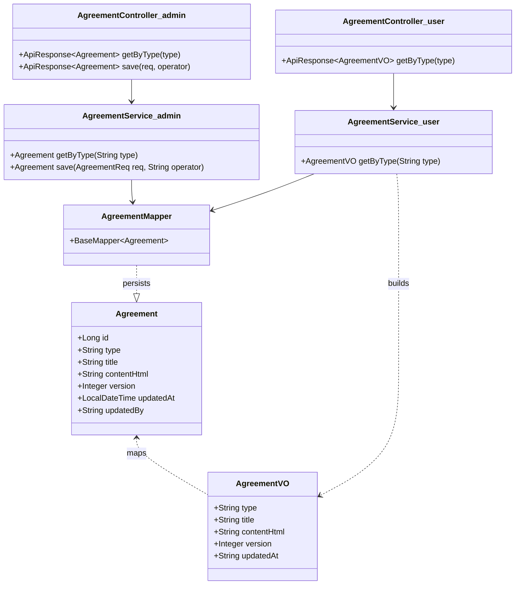
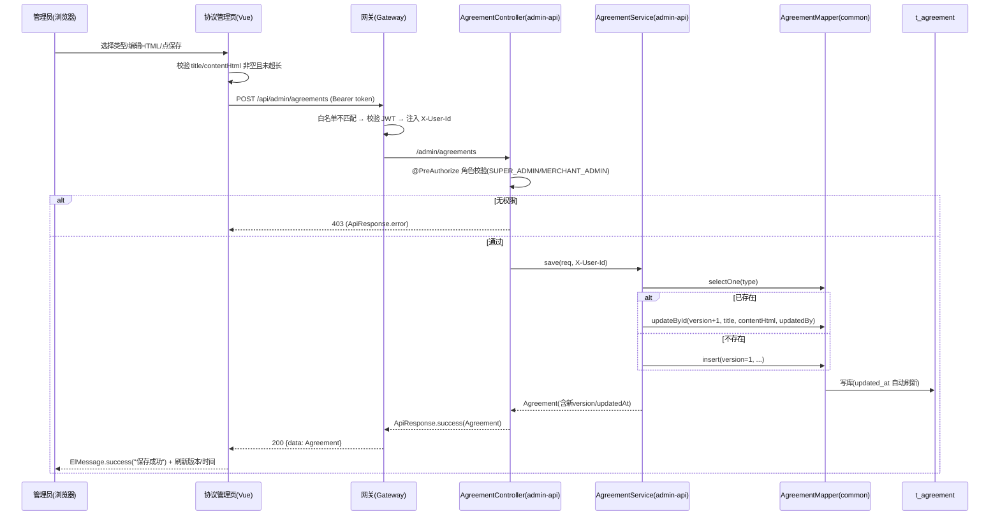
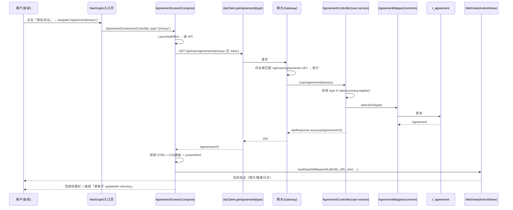

# 架构设计：协议文档可视化编辑与 WebView 展示（v1.0）

> 作者：架构师（高见远）
> 技术栈：后端 Spring Boot 3.1.5 多模块（task-admin-api / task-user-service / task-upload-service / task-common / task-gateway）；管理前端 Vue 3 + TS + Element Plus 2.x + Pinia；安卓 Kotlin 2.0.21 + Jetpack Compose。
> 配套文档：PRD《协议文档可视化编辑与 WebView 展示 v1.0》。

---

## 0. 代码探查结论（真实文件路径 + 关键片段）

设计前已实际对齐现有代码，结论如下（非凭空设计）：

### 0.1 后端参照模式
| 关注点 | 真实文件 | 关键事实 |
|---|---|---|
| 写接口范本 | `backend/task-admin-api/src/main/java/com/task/platform/admin/controller/SysConfigController.java` | `@RequestMapping("/admin/settings")` + `@PreAuthorize("hasAnyRole('SUPER_ADMIN','MERCHANT_ADMIN')")` + `ApiResponse.success/error`。**注意：映射路径无 `/api` 前缀**。 |
| 服务层范本 | `backend/task-admin-api/src/main/java/com/task/platform/admin/service/SysConfigService.java` | `@Service @RequiredArgsConstructor`，注入 `SysConfigMapper`，用 `LambdaQueryWrapper` + `BaseMapper`。 |
| 实体范本 | `backend/task-admin-api/src/main/java/com/task/platform/admin/entity/SysConfig.java` | `@Data @TableName("sys_config")` + `@TableId(type=IdType.AUTO)` + MyBatis-Plus 注解。 |
| 统一响应体 | `backend/task-common/src/main/java/com/task/platform/common/response/ApiResponse.java` | `ApiResponse<T>{code,msg,data,timestamp}`；`success(T)`、`success(T,msg)`、`error(code,msg)`、`error(ErrorCode)`。 |
| 上传复用 | `backend/task-upload-service/src/main/java/com/task/platform/upload/controller/UploadController.java` | `POST /upload/image`（`StripPrefix=1` 后），返回 `UploadResult{relativePath, accessUrl, filename, size}`。 |
| 上传 URL 构造 | `backend/task-upload-service/src/main/java/com/task/platform/upload/storage/LocalFileStorageService.java` `getAccessUrl()` | 返回相对 URL：`/api/upload/uploads/{type}/{filename}`（**不含域名**，由网关路由）。 |
| 公开读接口范本 | `backend/task-user-service/src/main/java/com/task/platform/user/controller/SysConfigController.java` | `@RequestMapping("/user/config")` + `@GetMapping` 匿名；外部即 `/api/user/config`。 |
| user-service Mapper 风格 | `backend/task-user-service/src/main/java/com/task/platform/user/mapper/SysConfigMapper.java` | 纯 `@Mapper` + `@Select` SQL（**未用 BaseMapper**），与 admin-api 风格不同。 |
| 网关路由 | `backend/task-gateway/src/main/resources/application.yml` | `/api/user/**`→:8081、`/api/admin/**`→:8084、`/api/upload/**`→:8086，均 `StripPrefix=1`。 |
| 网关鉴权白名单 | `backend/task-gateway/src/main/java/com/task/platform/gateway/filter/JwtAuthGlobalFilter.java` | `WHITE_LIST` 用 `path.startsWith(...)` 匹配；例：`new WhiteListEntry("/api/user/config","GET")`。 |
| 数据源 | `backend/task-admin-api/src/main/resources/application.yml` 与 `backend/task-user-service/src/main/resources/application.yml` | **两模块连同一库** `jdbc:mysql://118.145.198.135:3306/task_platform` → 共享 `t_agreement` 表成立。 |
| Mapper 扫描范围 | `AdminApplication.java`: `@MapperScan("com.task.platform.admin.mapper")`；`UserApplication.java`: `@MapperScan("com.task.platform.user.mapper")` | **各自只扫本模块包** → 若把 Mapper 放 task-common，必须扩展两处 `@MapperScan`。 |
| task-common 现状 | `backend/task-common/pom.xml` | 仅有 web/lombok/hutool/fastjson2/validation/redis/jwt；**无 MyBatis/MyBatis-Plus** → 放实体/Mapper 需补依赖。 |

表结构证据：`sql/sys_config.sql` 中 `config_value VARCHAR(500)`，确证大段 HTML 不宜入 `sys_config`，需独立表 `t_agreement`（采用 `LONGTEXT`）。

### 0.2 前端参照模式
| 关注点 | 真实文件 | 关键事实 |
|---|---|---|
| 设置页 | `frontend/admin-frontend/src/views/settings/index.vue` | `<script setup lang="ts">` + Element Plus（`el-card/el-table/el-dialog/el-form/el-switch`）+ `ElMessage` + `@element-plus/icons-vue`。 |
| API 封装 | `frontend/admin-frontend/src/api/settings.ts` | `import request from '@/utils/request'`；`request.get<SysConfigItem[]>('/settings')`、`request.put('/settings', data)`。 |
| 请求实例 | `frontend/admin-frontend/src/utils/request.ts` | `axios.create({ baseURL: import.meta.env.VITE_API_BASE_URL \|\| '/api/admin' })`；拦截器：成功取 `res.data`、401 跳登录、错误 `ElMessage.error`。**故 `/settings` → `/api/admin/settings`**。 |
| 路由 | `frontend/admin-frontend/src/router/index.ts` | 子路由 `children` + `meta:{title}`；懒加载 `() => import('../views/...')`。 |
| 菜单 | `frontend/admin-frontend/src/components/Layout.vue` | `el-menu` + `el-menu-item index="/settings"`；`系统设置` 仅 `v-if="isSuperAdmin"`。 |
| 依赖 | `frontend/admin-frontend/package.json` | Vue3.5 / Element Plus 2.13 / Pinia 3 / vue-router 4 / axios 1.16；**无 wangEditor**（需新增）。 |

### 0.3 安卓参照模式
| 关注点 | 真实文件 | 关键事实 |
|---|---|---|
| 导航图 | `android/app/src/main/java/com/task/platform/navigation/TaskNavGraph.kt` | `object TaskRoutes{ const val ABOUT="about"; SETTINGS="settings"; PROFILE="profile" }`；`composable(TaskRoutes.ABOUT){ AboutScreen(navController) }`。**注意：此前 Glob 命中的同名文件为旧副本（仅 EARNINGS/WITHDRAW），本文以本路径为准。** |
| 关于页 | `android/app/src/main/java/com/task/platform/ui/profile/AboutScreen.kt` | `@Composable fun AboutScreen(navController)`；顶部返回箭头 `Icons.Filled.ArrowBack` + `navController.popBackStack()`。 |
| 设置页 | `android/app/src/main/java/com/task/platform/ui/profile/SettingsScreen.kt` | 复用 `SettingsCard(title,content)`；`Button(onClick={navController.navigate("about")})`。注意 import：`import androidx.compose.foundation.layout.*`（第13行，`weight()` 来自此）、`import androidx.compose.material.icons.Icons`（第27行，供 `Icons.Default.ArrowBack`）。 |
| 网络层 | `android/app/src/main/java/com/task/platform/network/ApiClient.kt` | Retrofit `ApiService` 接口；`BASE_URL = BuildConfig.BASE_URL`；匿名示例 `@GET("api/user/config") suspend fun getAppConfig(): ApiResponse<Map<String,String>>`；拦截器仅在 `token` 非空时加 `Authorization`。 |
| 统一响应 | `android/app/src/main/java/com/task/platform/model/Models.kt` | `data class ApiResponse<T>(val code, val msg, val data, val timestamp)`（与后端逐一对应）。 |
| 图片 URL 范式 | `android/app/src/main/java/com/task/platform/ui/publish/PublishScreen.kt`（L1840-1848） | `val base = BuildConfig.BASE_URL.trimEnd('/')`，相对路径 `/api/upload/...` 直接拼接 base → 走网关到 upload-service。 |
| 清单 | `android/app/src/main/AndroidManifest.xml` | 已含 `<uses-permission android:name="android.permission.INTERNET"/>` 与 `android:usesCleartextTraffic="true"` → WebView 加载 http 图片无需改清单。 |
| 依赖 | `android/app/build.gradle.kts` | `buildConfigField("String","BASE_URL","\"http://10.0.2.2:8085/\"")`；WebView 为 Android 原生，无需额外依赖。 |

---

## 1. 实现方案 + 框架选型

### 1.1 总体架构
- **写链路**：管理前端（Vue3 + wangEditor）→ `POST/GET /api/admin/agreements`（网关转发 `/admin/agreements` → admin-api）→ RBAC `@PreAuthorize` → `AgreementService` → `t_agreement`（MyBatis-Plus）。
- **读链路（匿名）**：安卓 `AgreementScreen` → `GET /api/user/agreements/{type}`（网关白名单放行 → user-service）→ 返回 HTML → `AndroidView` 内 `WebView` 渲染（baseUrl=BASE_URL）。
- **图片**：wangEditor 上传走现有 `task-upload-service`（`POST /api/upload/image`），返回相对 `accessUrl`（`/api/upload/uploads/...`）；HTML 中**原样存储相对 URL**，由安卓 WebView 的 `baseUrl=BuildConfig.BASE_URL` 与前端同源解析，无需把 `upload_domain` 写死进 HTML（更符合现有 `PublishScreen` 范式，且换域名零改动）。

### 1.2 关键技术选型
| 项 | 选型 | 理由 |
|---|---|---|
| 富文本编辑器 | **wangEditor v5**（`@wangeditor/editor` + `@wangeditor/editor-for-vue`） | 主理人已拍板；中文友好、输出标准 HTML、与 Element Plus 组合式 API 易集成（`Editor`/`Toolbar` 组件）。 |
| 存储 | **新建独立表 `t_agreement`**（`LONGTEXT` 存 HTML） | `sys_config.config_value` 仅 `VARCHAR(500)`，已证实不适合大文本。 |
| 跨模块数据访问 | **方案 A：`t_agreement` 实体 + Mapper 放 `task-common`，admin-api（写）与 user-service（读）共用**（详见 1.3） | 读写同表同结构，共享避免实体漂移；为主理人推荐默认。 |
| 移动端渲染 | **`AndroidView` 包裹 `WebView` + 注入移动端适配 CSS 模板** | 原样展示 HTML5（图片、链接、列表），`baseUrl` 解决相对图片路径。 |
| 网关放行 | 在 `JwtAuthGlobalFilter.WHITE_LIST` 增加 `new WhiteListEntry("/api/user/agreements","GET")` | 复用既有白名单机制（`startsWith` 匹配覆盖 `/api/user/agreements/{type}`），无需改路由表。 |

### 1.3 跨模块数据访问决策（主理人待确认项 #3）
**结论：采用方案 A —— `Agreement` 实体与 `AgreementMapper` 放在 `task-common`，两模块共用。**

理由：
1. **同库已证实**：admin-api 与 user-service 的 datasource 指向同一 `task_platform` 库，物理共享表无障碍。
2. **读写结构完全一致**：`t_agreement` 的字段在写入端与读取端完全相同，放 task-common 可避免像 `SysConfig` 那样在两端各维护一份实体（现有 SysConfig 是历史重复，新共享数据应更优）。
3. **改动小且确定**：仅需 (a) 给 `task-common/pom.xml` 增加 `mybatis-plus-boot-starter`；(b) 把 `com.task.platform.common.mapper` 追加进 admin-api 与 user-service 的 `@MapperScan`。两处 `@MapperScan` 当前分别为 `com.task.platform.admin.mapper` / `com.task.platform.user.mapper`（已在 0.1 查证），扩展后共享 Mapper 即被注册。
4. **降级方案（若不愿在 task-common 引入持久层）**：退回方案 B —— 在 `task-user-service` 放**只读** `AgreementMapper`（`@Select` 按 type 查询，风格对齐其现有 `SysConfigMapper`），在 `task-admin-api` 放完整 `Agreement` 实体+Mapper（对齐其现有 `SysConfig`）。功能等价，但实体需双份维护。本设计按方案 A 落地，T1 会明确写出两种 `@MapperScan` 改法。

### 1.4 WebView 移动端适配方案
HTML 存储为「纯内容片段」（`content_html`），安卓拼装为完整文档：
```html
<!DOCTYPE html><html lang="zh-CN"><head><meta charset="utf-8">
<meta name="viewport" content="width=device-width, initial-scale=1.0, maximum-scale=1.0, user-scalable=no">
<style>
  body{margin:0;padding:16px;font-family:-apple-system,"PingFang SC","Microsoft YaHei",sans-serif;
       font-size:16px;line-height:1.7;color:#222;word-wrap:break-word;word-break:break-word;}
  img{max-width:100%!important;height:auto!important;border-radius:6px;margin:8px 0;}
  a{color:#ff8c00;word-break:break-all;}
  h1,h2,h3{line-height:1.4;} pre{white-space:pre-wrap;background:#f6f6f6;padding:10px;border-radius:6px;overflow-x:auto;}
  table{border-collapse:collapse;width:100%;} td,th{border:1px solid #ddd;padding:6px;}
</style></head><body>${content_html}</body></html>
```
加载方式：`webView.loadDataWithBaseURL(BuildConfig.BASE_URL, html, "text/html", "utf-8", null)`。`baseUrl` = `BASE_URL`（如 `http://10.0.2.2:8085/`），使 HTML 中的相对图片 `src="/api/upload/uploads/..."` 解析为 `BASE_URL + /api/upload/uploads/...` → 网关 → upload-service 静态资源（白名单已含 `/api/upload/uploads` GET）。

---

## 2. 文件列表及相对路径

### 2.1 后端（新建 / 修改）
| 操作 | 相对路径 | 说明 |
|---|---|---|
| 修改 | `backend/task-common/pom.xml` | 增加 `mybatis-plus-boot-starter` 依赖（供实体/Mapper 编译）。 |
| **新建** | `backend/task-common/src/main/java/com/task/platform/common/entity/Agreement.java` | `t_agreement` 实体（共享）。 |
| **新建** | `backend/task-common/src/main/java/com/task/platform/common/mapper/AgreementMapper.java` | `extends BaseMapper<Agreement>`（共享）。 |
| **新建** | `backend/sql/agreement.sql` | 建表 SQL（含 `uk_type` 唯一索引）+ 三行初始数据（`INSERT IGNORE`）。 |
| 修改 | `backend/task-admin-api/src/main/java/com/task/platform/admin/AdminApplication.java` | `@MapperScan` 追加 `com.task.platform.common.mapper`。 |
| **新建** | `backend/task-admin-api/src/main/java/com/task/platform/admin/controller/AgreementController.java` | 写接口 `GET/POST /admin/agreements`，`@PreAuthorize`。 |
| **新建** | `backend/task-admin-api/src/main/java/com/task/platform/admin/service/AgreementService.java` | 写业务逻辑（upsert、version++、记 updated_by/updated_at）。 |
| 修改 | `backend/task-user-service/src/main/java/com/task/platform/user/UserApplication.java` | `@MapperScan` 追加 `com.task.platform.common.mapper`。 |
| **新建** | `backend/task-user-service/src/main/java/com/task/platform/user/controller/AgreementController.java` | 公开读接口 `GET /user/agreements/{type}`（匿名）。 |
| **新建** | `backend/task-user-service/src/main/java/com/task/platform/user/service/AgreementService.java` | 读业务逻辑（类型校验、缺省空态）。 |
| 修改 | `backend/task-gateway/src/main/java/com/task/platform/gateway/filter/JwtAuthGlobalFilter.java` | `WHITE_LIST` 增加 `/api/user/agreements` GET。 |

### 2.2 前端（新建 / 修改）
| 操作 | 相对路径 | 说明 |
|---|---|---|
| **新建** | `frontend/admin-frontend/src/views/agreements/index.vue` | 协议管理编辑页（Tab 切换 + wangEditor + 标题/保存/预览 + 版本信息）。 |
| **新建** | `frontend/admin-frontend/src/api/agreements.ts` | `getAgreement(type)` / `saveAgreement(payload)`。 |
| 修改 | `frontend/admin-frontend/src/router/index.ts` | 增加 `agreements` 子路由。 |
| 修改 | `frontend/admin-frontend/src/components/Layout.vue` | 侧边栏新增「协议管理」菜单项。 |
| 修改 | `frontend/admin-frontend/package.json` | 增加 `@wangeditor/editor`、`@wangeditor/editor-for-vue` 依赖。 |

### 2.3 安卓（新建 / 修改）
| 操作 | 相对路径 | 说明 |
|---|---|---|
| **新建** | `android/app/src/main/java/com/task/platform/ui/profile/AgreementScreen.kt` | 协议展示页（`AndroidView`+`WebView`，按 type 拉取并渲染）。 |
| 修改 | `android/app/src/main/java/com/task/platform/navigation/TaskNavGraph.kt` | 新增 `AGREEMENT="agreement/{type}"` 路由 + `composable` 注册。 |
| 修改 | `android/app/src/main/java/com/task/platform/ui/profile/AboutScreen.kt` | 底部新增「查看协议」按钮 → `navController.navigate("agreement/about")`。 |
| 修改 | `android/app/src/main/java/com/task/platform/ui/profile/SettingsScreen.kt` | 新增「隐私协议」「注册协议」两项 `SettingsCard` → 对应 navigate。 |
| 修改 | `android/app/src/main/java/com/task/platform/model/Models.kt` | 新增 `AgreementVO` data class。 |
| 修改 | `android/app/src/main/java/com/task/platform/network/ApiClient.kt` | `ApiService` 新增 `getAgreement(type)`。 |

---

## 3. 数据结构与接口（类图 / 表结构 / API 契约）

### 3.1 建表 SQL（`backend/sql/agreement.sql`）
```sql
-- 协议文档表（替代将大段 HTML 塞入 sys_config）
CREATE TABLE IF NOT EXISTS t_agreement (
    id           BIGINT       NOT NULL AUTO_INCREMENT COMMENT '主键',
    type         VARCHAR(20)  NOT NULL                COMMENT '协议类型: about/privacy/register',
    title        VARCHAR(200) NOT NULL                COMMENT '协议标题',
    content_html LONGTEXT                            COMMENT '协议HTML内容（标准HTML片段）',
    version      INT          NOT NULL DEFAULT 1     COMMENT '版本号，每次保存自增',
    updated_at   DATETIME     DEFAULT CURRENT_TIMESTAMP ON UPDATE CURRENT_TIMESTAMP COMMENT '更新时间',
    updated_by   VARCHAR(50)  DEFAULT ''              COMMENT '最后操作人（admin 用户ID）',
    PRIMARY KEY (id),
    UNIQUE KEY uk_type (type)
) ENGINE=InnoDB DEFAULT CHARSET=utf8mb4 COMMENT='协议文档表';

-- 初始数据（幂等：已存在则跳过，不覆盖运营已编辑内容）
INSERT IGNORE INTO t_agreement (type, title, content_html, version) VALUES
('about',   '关于我们', '<p>关于我们内容待编辑。</p>', 1),
('privacy', '隐私协议', '<p>隐私协议内容待编辑。</p>', 1),
('register','注册协议', '<p>注册协议内容待编辑。</p>', 1);
```

### 3.2 实体与 Mapper（放 `task-common`）
`Agreement.java`：
```java
package com.task.platform.common.entity;
import com.baomidou.mybatisplus.annotation.*;
import lombok.Data;
import java.time.LocalDateTime;

@Data
@TableName("t_agreement")
public class Agreement {
    @TableId(type = IdType.AUTO) private Long id;
    private String type;        // about / privacy / register
    private String title;
    private String contentHtml; // 标准 HTML 片段
    private Integer version;
    @TableField(fill = FieldFill.INSERT_UPDATE) private LocalDateTime updatedAt;
    private String updatedBy;
}
```
`AgreementMapper.java`：
```java
package com.task.platform.common.mapper;
import com.baomidou.mybatisplus.core.mapper.BaseMapper;
import com.task.platform.common.entity.Agreement;
import org.apache.ibatis.annotations.Mapper;

@Mapper
public interface AgreementMapper extends BaseMapper<Agreement> { }
```

### 3.3 类图（后端 + 共享）


### 3.4 API 契约（复用项目既有 `ApiResponse<T>`：`{code,msg,data,timestamp}`）

#### 3.4.1 写接口（admin-api，RBAC）
- `GET /api/admin/agreements?type=about`
  - 网关：`StripPrefix=1` → `/admin/agreements` → `AgreementController`。
  - 鉴权：`@PreAuthorize("hasAnyRole('SUPER_ADMIN','MERCHANT_ADMIN')")`。
  - 返回：当前 `Agreement`（无数据返回 `data=null`）。
- `POST /api/admin/agreements`
  - 请求体：`{ "type": "about", "title": "关于我们", "contentHtml": "<p>...</p>" }`
  - 行为：按 `type` upsert；存在则 `version = version+1` 并 `updateById`，不存在则 `version=1` 插入；`updated_by` 取网关注入的请求头 `X-User-Id`（缺失则 `"system"`），`updated_at` 自动刷新。
  - 返回：`ApiResponse<Agreement>`（含最新 `version`/`updatedAt`）。

#### 3.4.2 读接口（user-service，匿名）
- `GET /api/user/agreements/{type}`
  - 网关：路由 `/api/user/**` → `StripPrefix=1` → `/user/agreements/{type}`；白名单放行（无需 token）。
  - 校验：`type` 必须 ∈ `{about, privacy, register}`，否则 `ApiResponse.error(400,"不支持的协议类型")`。
  - 数据缺失：`type` 合法但库无记录 → 返回 `ApiResponse.success(...)` 且 `contentHtml=""`（友好空态，WebView 展示占位）。
  - 返回 `AgreementVO`：`{ "type":"about", "title":"关于我们", "contentHtml":"<p>...</p>", "version":3, "updatedAt":"2025-07-12 21:44:00" }`。

### 3.5 安卓数据模型（`Models.kt` 新增）
```kotlin
/** 协议文档 VO（对应后端 AgreementVO / t_agreement） */
data class AgreementVO(
    val type: String = "",
    val title: String = "",
    val contentHtml: String = "",
    val version: Int = 0,
    val updatedAt: String? = null
)
```

---

## 4. 程序调用流程（时序图）

### 4.1 保存流程（后台编辑 → 写接口 → RBAC → 写 t_agreement）


### 4.2 展示流程（安卓进入 → 公开读接口 → WebView 渲染）


---

## 5. 任务列表（有序、含依赖、按实现顺序）

> 共 5 个任务（≤5，符合分批落地约束），每个任务 ≥3 个文件，按依赖顺序排列。

### T1 后端：建表 SQL + task-common 实体/Mapper（基础设施）
- **依赖前置**：无（首任务）。
- **涉及文件**：
  - `backend/sql/agreement.sql`（新建）
  - `backend/task-common/src/main/java/com/task/platform/common/entity/Agreement.java`（新建）
  - `backend/task-common/src/main/java/com/task/platform/common/mapper/AgreementMapper.java`（新建）
  - `backend/task-common/pom.xml`（修改：加 `mybatis-plus-boot-starter`）
  - `backend/task-admin-api/src/main/java/com/task/platform/admin/AdminApplication.java`（修改：`@MapperScan` 追加 `com.task.platform.common.mapper`）
  - `backend/task-user-service/src/main/java/com/task/platform/user/UserApplication.java`（修改：`@MapperScan` 追加 `com.task.platform.common.mapper`）
- **验收点**：
  1. `agreement.sql` 在 `task_platform` 库执行成功，`t_agreement` 存在且 `uk_type` 唯一；三行初始数据就位。
  2. `task-common` 编译通过（实体/Mapper 可被两模块引用）。
  3. 两模块启动后 `AgreementMapper` Bean 均被注册（日志无 `UnsatisfiedDependencyException`）。

### T2 后端：admin-api 写接口（AgreementController + Service）
- **依赖前置**：T1。
- **涉及文件**：
  - `backend/task-admin-api/src/main/java/com/task/platform/admin/controller/AgreementController.java`（新建）
  - `backend/task-admin-api/src/main/java/com/task/platform/admin/service/AgreementService.java`（新建）
- **验收点**：
  1. `GET /api/admin/agreements?type=about` 返回当前内容（未登录/非 SUPER_ADMIN|MERCHANT_ADMIN 返回 401/403）。
  2. `POST /api/admin/agreements` 保存后 `version` 自增、`updated_at` 刷新、`updated_by` 记录 `X-User-Id`。
  3. 连续保存两次 `version` 递增；非法/空内容被校验拦截；返回标准 `ApiResponse`。

### T3 后端：user-service 公开读接口 + 网关匿名放行
- **依赖前置**：T1。
- **涉及文件**：
  - `backend/task-user-service/src/main/java/com/task/platform/user/controller/AgreementController.java`（新建）
  - `backend/task-user-service/src/main/java/com/task/platform/user/service/AgreementService.java`（新建）
  - `backend/task-gateway/src/main/java/com/task/platform/gateway/filter/JwtAuthGlobalFilter.java`（修改：白名单加 `/api/user/agreements` GET）
- **验收点**：
  1. 不带 token 直接 `GET /api/user/agreements/privacy` 返回 200 + `AgreementVO`。
  2. `type=xxx`（非法）返回 400；合法但无数据返回 200 且 `contentHtml=""`。
  3. 网关白名单生效（无 token 不返回 401）。

### T4 前端：协议管理编辑页（wangEditor 集成 + Tab + 保存/预览）
- **依赖前置**：T2（写接口就绪）。
- **涉及文件**：
  - `frontend/admin-frontend/src/views/agreements/index.vue`（新建）
  - `frontend/admin-frontend/src/api/agreements.ts`（新建）
  - `frontend/admin-frontend/src/router/index.ts`（修改：加 `agreements` 路由）
  - `frontend/admin-frontend/src/components/Layout.vue`（修改：加「协议管理」菜单）
  - `frontend/admin-frontend/package.json`（修改：加 wangEditor 依赖并 `npm install`）
- **验收点**：
  1. 菜单「协议管理」可进入；Tab 切换 about/privacy/register 各自加载对应内容。
  2. wangEditor 可编辑并输出合法 HTML；图片上传复用 `/api/upload/image` 且带 `Authorization` 头，得到相对 `accessUrl` 嵌入 HTML。
  3. 点「保存」→ `POST /api/admin/agreements` 成功提示，并刷新「版本 vX · 更新于 …」；空/超长内容有拦截。
  4. 「预览」按钮以只读方式渲染当前 HTML（移动端样式一致）。

### T5 安卓：AgreementScreen(WebView) + 入口 + 路由
- **依赖前置**：T3（读接口就绪）。
- **涉及文件**：
  - `android/app/src/main/java/com/task/platform/ui/profile/AgreementScreen.kt`（新建）
  - `android/app/src/main/java/com/task/platform/navigation/TaskNavGraph.kt`（修改：加 `AGREEMENT` 路由 + composable）
  - `android/app/src/main/java/com/task/platform/ui/profile/AboutScreen.kt`（修改：底部加「查看协议」→ `agreement/about`）
  - `android/app/src/main/java/com/task/platform/ui/profile/SettingsScreen.kt`（修改：加「隐私协议」「注册协议」→ `agreement/privacy|register`）
  - `android/app/src/main/java/com/task/platform/model/Models.kt`（修改：加 `AgreementVO`）
  - `android/app/src/main/java/com/task/platform/network/ApiClient.kt`（修改：加 `getAgreement(type)`）
- **验收点**：
  1. 三入口（About 底部、Settings 两项）均可进入对应 type 的 `AgreementScreen`。
  2. WebView 正确渲染 HTML（图片、链接可点），`baseUrl=BuildConfig.BASE_URL` 使相对图片正常加载。
  3. 顶部标题栏 + 返回键；底部展示「更新于 updatedAt vVersion」；每次进入按 type 拉取最新（P0 不缓存）。

---

## 6. 依赖包列表
| 端 | 包 | 版本/说明 | 是否新增 |
|---|---|---|---|
| 后端 | `mybatis-plus-boot-starter` | 与现有 admin-api/user-service 一致（Spring Boot 3.1.5 配套 3.5.x） | **新增至 task-common** |
| 后端 | `mybatis-plus-core` / `mybatis-plus-annotation` | 若不想引 boot-starter，可只引这两个（更轻） | 备选 |
| 前端 | `@wangeditor/editor` | wangEditor v5 核心 | **新增** |
| 前端 | `@wangeditor/editor-for-vue` | Vue3 封装组件 `Editor`/`Toolbar` | **新增** |
| 安卓 | `WebView`（Android SDK 自带） | 无需额外依赖 | 否 |
| 安卓 | 网络权限 / cleartext | 已在 `AndroidManifest.xml` 具备 | 否 |

> 后端其余（Spring Web、Lombok、Hutool、JWT 等）与 Redis 均已具备；`ApiResponse`/`JwtUtil` 在 task-common 复用，无需新增。

---

## 7. 共享知识（跨文件约定）

- **API 路径前缀**：前端管理端 `request` 的 `baseURL=/api/admin`，故前端调用写 `/agreements` 即命中 `/api/admin/agreements`；安卓读接口完整路径 `@GET("api/user/agreements/{type}")`（Retrofit 已含 `api/` 前缀，对齐 `ApiClient` 既有写法）。
- **ApiResponse 结构**：`{ code:int, msg:String, data:T, timestamp:long }`；成功 `code=200`；业务失败用 `ApiResponse.error(code,msg)`；前端拦截器仅放行 `code===200`。
- **HTML 存储格式**：`content_html` 存**标准 HTML 片段**（不含 `<html>/<head>/<body>`），图片以**相对 URL** `/api/upload/uploads/{type}/{filename}` 存储（来自上传返回 `accessUrl`），不在 HTML 中写死域名。
- **移动端 CSS 模板**（安卓 WebView 注入，见 1.4）：含 `viewport` + `img{max-width:100%}` + 基础排版 + `a` 配色；通过 `loadDataWithBaseURL(BuildConfig.BASE_URL, html, "text/html","utf-8", null)` 加载，`baseUrl` 解决相对图片路径（与 `PublishScreen` 既有范式一致）。
- **网关放行铁律**：新增匿名端点必须同时在 `JwtAuthGlobalFilter.WHITE_LIST` 注册（`new WhiteListEntry("/api/user/agreements","GET")`），否则 401。
- **RBAC 铁律**：写接口必须 `@PreAuthorize("hasAnyRole('SUPER_ADMIN','MERCHANT_ADMIN')")`，与 `SysConfigController` 对齐。
- **updated_by 取值**：admin-api 读网关注入的请求头 `X-User-Id`（JWT subject）；缺失时落 `"system"`。
- **安卓 import 铁律**（来自现有 `SettingsScreen.kt` 实证的坑）：
  - `Modifier.weight(1f)` 必须来自通配 `import androidx.compose.foundation.layout.*`（勿单独引 `layout` 子包导致找不到 `weight`）。
  - `item{}` 是 `LazyListScope` 扩展函数，**不要** `import androidx.compose.foundation.lazy.item`（会引入错误符号）；如需列表项用 `LazyColumn { item { ... } }`。
  - `Icons.Default.XXX` 需显式 `import androidx.compose.material.icons.Icons`（如 `Icons.Default.ArrowBack`）。
  - `AndroidView` 需 `import androidx.compose.ui.viewinterop.AndroidView`；`WebView` 需 `import android.webkit.WebView`。
- **图片上传鉴权**：wangEditor 的 `uploadImage.server` 设为 `/api/upload/image`，并在 `MENU_CONF['uploadImage'].headers` 注入 `Authorization: Bearer <localStorage.token>`（上传路径不在网关白名单，需带 token）。

---

## 8. 待明确事项
- **无**（主理人已就编辑器、存储、接口归属、跨模块方案、安卓缓存/版本感知、图片上传六项拍板，且本设计均已落地为具体文件与契约）。
- 仅作备注（非阻塞）：P2-1「版本已读比对提示」与 P2-2「后台预览」不在本期 P0/P1 范围，按 PRD 留作后续；预览按钮（T4）可先行以只读渲染满足 P2-2 的轻量版。
